<!-- 
@import url('https://fonts.googleapis.com/css2?family=Noto+Sans+Hebrew:wght@400;700&display=swap');

<style>
  body {
    direction: rtl;
    font-family: 'Noto Sans Hebrew', 'Segoe UI', sans-serif;
    line-height: 1.8;
    color: #333;
    background: #fff;
  }
  h1 {
    page-break-before: always;
    margin-top: 40px;
    margin-bottom: 20px;
    border-bottom: 2px solid #0066cc;
    padding-bottom: 10px;
  }
  h1:first-of-type {
    page-break-before: avoid;
  }
  h2 {
    margin-top: 25px;
    margin-bottom: 15px;
    color: #0066cc;
  }
  code, pre {
    background-color: #f5f5f5;
    border-radius: 4px;
    font-family: 'Courier New', monospace;
  }
  pre {
    padding: 12px;
    border-left: 3px solid #0066cc;
    overflow-x: auto;
  }
  table {
    width: 100%;
    border-collapse: collapse;
    margin: 15px 0;
  }
  table th {
    background-color: #0066cc;
    color: white;
    padding: 10px;
    text-align: right;
  }
  table td {
    border: 1px solid #ddd;
    padding: 8px;
  }
  .cover-page {
    page-break-after: always;
    text-align: center;
    padding: 60px 20px;
  }
</style>
-->

# ספר פרויקט גמר - Simple Shop

---

## עמוד שער

**שם המכללה:** [שם המכללה]  
**סמליל (לוגו):** [לוגו המכללה] | [לוגו מה"ט]  
**שם מגמה:** הנדסת תוכנה  
**מסלול הכשרה:** הנדסאי  

**נושא הפרויקט:**  
# מערכת E-Commerce מלאה לניהול חנות אונליין  
### עם תשלומים מאובטחים, ניהול מלאי בזמן אמת, ולוח ניהול מתקדם

**שמות הסטודנטים:**
- **[שם סטודנט 1]** – צד שרת (Backend API)
- **[שם סטודנט 2]** – צד לקוח (Frontend Application)

**שם המנחה האישי:** [שם המנחה]  
**תאריך מסירה:** 10/05/2026

---

## תוכן עניינים

### חלק א' - מבוא והצגת הפרויקט
1. [תיאור ורקע כללי](#131-תיאור-ורקע-כללי)
2. [מטרות המערכת](#132-מטרות-המערכת)
3. [סקירת מצב קיים בשוק](#133-סקירת-מצב-קיים-בשוק)
4. [מה הפרויקט מחדש ומשפר](#134-מה-הפרויקט-מחדש-ומשפר)

### חלק ב' - ליבה טכנית (Server)
5. [דרישות מערכת ופונקציונאליות](#135-דרישות-מערכת-ופונקציונאליות)
6. [בעיות צפויות ופתרונות](#136-בעיות-צפויות-ופתרונות)
7. [פתרון טכנולוגי נבחר](#137-פתרון-טכנולוגי-נבחר)
8. [מבני נתונים וארגון קבצים](#138-מבני-נתונים-וארגון-קבצים)
9. [תרשימי מערכת](#139-תרשימי-מערכת)
10. [מרכיב אלגוריתמי](#1310-מרכיב-אלגוריתמי)
11. [אבטחת מידע](#1311-אבטחת-מידע)
12. [קטעי קוד מרכזיים](#1312-קטעי-קוד-מרכזיים)

### חלק ג' - ליבה טכנית (Client)
13. [צד לקוח - סקירה](#2-צד-לקוח-frontend)

### חלק ד' - ניהול פרויקט
14. [משאבים נדרשים](#1312-משאבים-נדרשים)
15. [תכנית עבודה](#1313-תכנית-עבודה)
16. [תכנון בדיקות](#1314-תכנון-בדיקות)
17. [בקרת גרסאות](#1315-בקרת-גרסאות)
18. [תכנית הפקה סופית לספר](#1316-תכנית-הפקה-סופית-לספר-מבוסס-קוד-מקור)
19. [קטעי קוד מומלצים להטמעה](#1317-קטעי-קוד-מומלצים-להטמעה)

### חלק ה' - סיכום
20. [מה למדנו](#סיכום---מה-למדנו)

---

# חלק א' - מבוא והצגת הפרויקט

<!-- סגנון כתיבה: אקדמי - תיאורי, ענייני ומבוסס -->

## 1.3.1 תיאור ורקע כללי

### רקע והקשר

עם התרחבות תחום המסחר האלקטרוני, עסקים קטנים ובינוניים נדרשים להציע חוויית רכישה מקוונת אמינה, מאובטחת ונוחה לשימוש. במקרים רבים, הפתרונות הקיימים בשוק הם יקרים, מורכבים לתחזוקה, או מגבילים מבחינת התאמה לצרכים מקומיים וספציפיים של העסק.

פרויקט **Simple Shop** פותח כמענה לצורך זה, מתוך מטרה לבנות מערכת מסחר אלקטרוני מלאה המדגימה תכנון נכון, אבטחת מידע, חלוקת אחריות בין צד שרת וצד לקוח, ושילוב שירותים חיצוניים בסביבת ייצור.

### תיאור המערכת

Simple Shop היא מערכת מסחר אלקטרוני מלאה הכוללת רכיבי ליבה הנדרשים להפעלת חנות מקוונת:

- קטלוג מוצרים עם שליפה, סינון וחיפוש
- עגלת קניות וניהול הזמנות
- אינטגרציית תשלומים באמצעות Stripe
- ניהול משתמשים, אימות והרשאות
- ממשק ניהולי למוצרים, הזמנות וסטטיסטיקות
- שכבות אבטחה להגנה על תהליכי התחברות, תשלום וצריכת API

### חשיבות הפרויקט

> "בשנת 2025, 21% מכלל הרכישות בעולם בוצעו אונליין. עד 2027, המספר צפוי לעלות ל-25%."  
> — Statista, E-commerce Worldwide Report

מכאן עולה הצורך במערכות מסחר אלקטרוני שאינן רק פונקציונאליות, אלא גם מאובטחות, מתועדות וניתנות להרחבה. במסגרת פרויקט זה בחרנו לממש מערכת כזו באופן המדגים תהליך פיתוח מלא משלב התכנון ועד לשלב התיעוד והבדיקות.

---

## 1.3.2 מטרות המערכת

### מטרת העל

מטרת העל של הפרויקט היא לפתח מערכת חנות מקוונת עבור עסק קטן או בינוני, תוך שמירה על שלושה עקרונות מרכזיים:
- פשטות תפעולית למשתמש הקצה ולמנהל המערכת
- אבטחה מספקת עבור תהליכי אימות, רכישה ותשלום
- גמישות ארכיטקטונית המאפשרת תחזוקה והרחבה עתידית

### מטרות מדידות

| מטרה | יעד | מדד הצלחה |
|------|-----|-----------|
| **מהירות תגובה** | < 100ms | 95% מהבקשות |
| **זמינות** | 99.9% | uptime שנתי |
| **אבטחה** | 0 פרצות | penetration testing |
| **קלות שימוש** | < 5 דקות | זמן ללמוד את המערכת |
| **כיסוי בדיקות** | > 85% | test coverage |

### מטרות למידה

מעבר למימוש הפונקציונלי של המערכת, הוגדרו גם מטרות למידה מקצועיות:

- תכנון ארכיטקטורה מודולרית וברת תחזוקה
- יישום מנגנוני אבטחה במספר שכבות
- עבודה עם שירותים חיצוניים כגון Stripe, MongoDB Atlas ו-Redis
- כתיבת בדיקות אוטומטיות ותמיכה בתהליכי אימות איכות
- הכנת תיעוד טכני מסודר עבור המערכת

---

## 1.3.3 סקירת מצב קיים בשוק

### מצב קיים

עסקים קטנים המעוניינים למכור באינטרנט ניצבים בפני מספר חלופות עיקריות:

| אפשרות | יתרון | חיסרון |
|--------|-------|--------|
| **Shopify / Wix** | מוכן מהקופסה | עלות חודשית גבוהה (₪100-500) + עמלות |
| **WooCommerce** | חינמי, גמיש | דורש ידע טכני, איטי, פגיע לפריצות |
| **Magento** | עוצמתי, מלא תכונות | מורכב מאוד, דורש שרת חזק |
| **בנייה מאפס** | שליטה מלאה | זמן פיתוח עצום, סיכון לשגיאות |

### פער מזוהה

קיים פער בין פלטפורמות מסחר מוכנות אך יקרות ומוגבלות, לבין פיתוח עצמאי מלא המצריך השקעת זמן ומשאבים רבים. הפרויקט נועד להדגים פתרון ביניים: מערכת מודולרית, מבוססת קוד, הניתנת ללמידה, התאמה והרחבה.

---

## 1.3.4 מה הפרויקט מחדש ומשפר

### נקודות הייחוד של הפרויקט

| תכונה | מה קיים בשוק | מה עשינו |
|-------|-------------|----------|
| **מניעת Overselling** | רוב המערכות לא מטפלות | MongoDB Transactions אטומיות |
| **אבטחת Login** | רק סיסמה | Account Lockout + Rate Limiting + tokenVersion |
| **Webhook Reliability** | "fire and forget" | Idempotency + DB Tracking + Retry Logic |
| **Instant Logout** | Token נשאר תקף | tokenVersion - ביטול מיידי של כל הטוקנים |
| **תיעוד** | לרוב חסר | OpenAPI Spec + Postman Collection מלאה |

### תרומת הפרויקט

לפרויקט תרומה במספר מישורים:

- ברמה הלימודית: הדגמת פרויקט מלא הכולל Backend, Frontend, תיעוד ובדיקות
- ברמה הטכנית: מימוש מנגנוני אמינות ואבטחה הרלוונטיים למערכות מסחר
- ברמת התחזוקה: קוד מאורגן, מודולרי וניתן להרחבה עתידית

---

<!-- ========== SERVER-SECTION-START ========== -->
<!-- להסרת חלק השרת, בקש: "הסר את כל סעיפי השרת מהספר" -->

# חלק ב' - ליבה טכנית: צד שרת (Backend)

<!-- סגנון כתיבה: טכני - כמו CTO שמסביר למתכנתים -->

## 1.3.5 דרישות מערכת ופונקציונאליות

### 1.3.5.1 דרישות מערכת (Non-Functional)

| קטגוריה | דרישה | פירוט |
|---------|-------|-------|
| **סביבה** | Node.js 22.x | Runtime environment |
| | MongoDB 8.x | Primary database |
| | Redis 5.x | Caching & sessions |
| **ביצועים** | Latency < 100ms | 95th percentile |
| | Throughput 100+ RPS | Requests per second |
| | Concurrent users 500+ | Simultaneous connections |
| **שרידות** | Graceful shutdown | No lost requests on restart |
| | Auto-reconnect | DB/Redis connection recovery |
| | Health checks | Liveness & readiness probes |
| **עומסים** | Rate limiting | Per-user & per-IP |
| | Connection pooling | DB connection reuse |
| | Response caching | Redis-based caching |

### 1.3.5.2 דרישות פונקציונאליות

#### מודול Authentication
| פעולה | Endpoint | תיאור |
|-------|----------|-------|
| הרשמה | `POST /auth/register` | יצירת חשבון חדש |
| התחברות | `POST /auth/login` | אימות + JWT token |
| התחברות עם Google | `POST /auth/google` | אימות OAuth וקבלת טוקנים |
| התנתקות | `POST /auth/logout` | ביטול כל הטוקנים (tokenVersion) |
| רענון טוקן | `POST /auth/refresh` | קבלת access token חדש |
| אימות | `GET /auth/verify` | בדיקת תקינות הטוקן |
| בקשת איפוס סיסמה | `POST /auth/forgot-password` | יצירת תהליך איפוס סיסמה |
| איפוס סיסמה בפועל | `POST /auth/reset-password/:token` | הגדרת סיסמה חדשה |
| פרופיל משתמש | `GET/PUT /auth/profile` | שליפה ועדכון פרופיל |
| שינוי סיסמה | `POST /auth/change-password` | שינוי סיסמה למשתמש מחובר |

#### מודול Products
| פעולה | Endpoint | תיאור |
|-------|----------|-------|
| רשימת מוצרים | `GET /products` | עם סינון וחיפוש |
| רשימת קטגוריות | `GET /products/categories/list` | שליפת קטגוריות מוצרים |
| מוצר בודד | `GET /products/:id` | פרטי מוצר מלאים |

#### מודול Cart
| פעולה | Endpoint | תיאור |
|-------|----------|-------|
| צפייה בעגלה | `GET /cart` | פריטים + סכום |
| הוספת פריט | `POST /cart/add` | עם בדיקת מלאי |
| עדכון כמות | `PUT /cart/update` | עם בדיקת מלאי |
| הסרת פריט | `DELETE /cart/remove` | הסרה מהעגלה |
| ריקון עגלה | `DELETE /cart/clear` | הסרת כל הפריטים |

#### מודול Orders
| פעולה | Endpoint | תיאור |
|-------|----------|-------|
| יצירת הזמנה | `POST /orders` | מהעגלה + כתובת |
| רשימת הזמנות | `GET /orders` | הזמנות המשתמש |
| הזמנה בודדת | `GET /orders/:id` | פרטים מלאים |
| ביטול | `POST /orders/:id/cancel` | לפני שילוח בלבד |
| מעקב פומבי | `GET /orders/track/:orderId` | מעקב הזמנה ללא login |

#### מודול Addresses
| פעולה | Endpoint | תיאור |
|-------|----------|-------|
| כל הכתובות | `GET /addresses` | ספר כתובות של המשתמש |
| ברירת מחדל | `GET /addresses/default` | כתובת ברירת מחדל |
| כתובת בודדת | `GET /addresses/:addressId` | שליפת כתובת לפי מזהה |
| יצירה | `POST /addresses` | הוספת כתובת חדשה |
| עדכון | `PUT /addresses/:addressId` | עדכון כתובת קיימת |
| מחיקה | `DELETE /addresses/:addressId` | מחיקת כתובת |
| קביעת ברירת מחדל | `POST /addresses/:addressId/set-default` | סימון כתובת כברירת מחדל |

#### מודול Payments
| פעולה | Endpoint | תיאור |
|-------|----------|-------|
| יצירת Checkout | `POST /payments/create-intent` | Stripe session |
| Alias ל-checkout | `POST /payments/checkout` | נקודת קצה חלופית ליצירת תשלום |
| סטטוס תשלום | `GET /payments/:orderId/status` | סטטוס התשלום להזמנה |
| Webhook | `POST /payments/webhook` | קבלת אירועים מ-Stripe |

#### מודול Admin
| פעולה | Endpoint | תיאור |
|-------|----------|-------|
| סטטיסטיקות | `GET /admin/stats/summary` | מכירות, הזמנות, מלאי |
| מוצרים | `GET /admin/products` | רשימת מוצרים מלאה לאדמין |
| יצירת מוצר | `POST /admin/products` | יצירת מוצר חדש |
| עדכון מוצר | `PUT /admin/products/:id` | עדכון מוצר |
| מחיקת מוצר | `DELETE /admin/products/:id` | Soft delete לאדמין |
| משתמשים | `GET /admin/users` | רשימת כל המשתמשים |
| שינוי role | `PUT /admin/users/:id/role` | user ↔ admin |
| כל ההזמנות | `GET /admin/orders` | עם פילטרים |
| עדכון סטטוס | `PUT /admin/orders/:id/status` | שינוי סטטוס הזמנה |

#### מודול Health & Metrics
| פעולה | Endpoint | תיאור |
|-------|----------|-------|
| Health root | `GET /health` | בדיקת readiness בסיסית |
| Health API | `GET /api/health` , `GET /api/health/ping` | בדיקות בריאות API |
| Prometheus scrape | `GET /metrics` | endpoint גלובלי ל-scraping |
| Payment metrics | `GET /metrics/payment` | מדדי תשלומים למשתמש מאומת |
| Webhook metrics | `GET /metrics/webhook` | מדדי webhook למשתמש מאומת |
| Export metrics | `GET /metrics/all` | ייצוא כל המדדים |

---

## 1.3.6 בעיות צפויות ופתרונות

### 1.3.6.1 תיאור הבעיות

| בעיה | תיאור | חומרה | השלכות |
|------|-------|-------|--------|
| **Race Conditions** | שני לקוחות קונים את המוצר האחרון בו-זמנית | 🔴 קריטי | Overselling, הפסד כספי |
| **Brute Force** | ניסיונות login חוזרים לפריצת סיסמה | 🔴 קריטי | גניבת חשבונות |
| **Webhook Replay** | Stripe שולח webhook פעמיים | 🟠 גבוה | חיוב כפול |
| **Token Theft** | גניבת JWT token | 🟠 גבוה | התחזות למשתמש |
| **DDoS** | הצפת השרת בבקשות | 🟡 בינוני | השבתת השירות |

### 1.3.6.2 פתרונות שנבחרו

| בעיה | פתרונות אפשריים | הפתרון שבחרנו | סיבה |
|------|-----------------|---------------|------|
| **Race Conditions** | 1. Optimistic locking<br>2. Pessimistic locking<br>3. **MongoDB Transactions** | MongoDB Transactions | אטומיות מלאה, rollback אוטומטי |
| **Brute Force** | 1. CAPTCHA<br>2. **Account Lockout + Rate Limit**<br>3. 2FA | Account Lockout + Rate Limiting | UX טוב יותר מ-CAPTCHA, פשוט יותר מ-2FA |
| **Webhook Replay** | 1. **Idempotency Keys**<br>2. Event sourcing | Idempotency + DB Tracking | פשוט, אמין, מאפשר auditing |
| **Token Theft** | 1. Short expiry<br>2. **tokenVersion**<br>3. Token blacklist | tokenVersion | ביטול מיידי, ללא DB lookup בכל בקשה |
| **DDoS** | 1. **Rate Limiting**<br>2. WAF<br>3. CDN | Rate Limiting per IP/User | פשוט, יעיל, לא דורש שירות חיצוני |

---

## 1.3.7 פתרון טכנולוגי נבחר

### 1.3.7.1 טופולוגיית הפתרון

```mermaid
flowchart TB
  subgraph Clients[Clients]
    Web["Web Browser"]
    Mobile["Mobile App"]
    Admin["Admin Panel"]
  end

  subgraph Render[Render.com (PaaS)]
    subgraph Node[Node.js Server]
      Routes[Routes]
      MW[Middlewares]
      Ctrl[Controllers]
      Svc["Services<br/>(Business Logic)"]
      Routes --> MW --> Ctrl --> Svc
    end
  end

  DB[("MongoDB Atlas<br/>Database<br/>- Users<br/>- Products<br/>- Orders<br/>- Payments")]
  Redis[("Redis Cloud<br/>Cache<br/>- Rate limits<br/>- Session cache<br/>- Cart cache")]
  Stripe[("Stripe<br/>Payments<br/>- Checkout<br/>- Webhooks<br/>- Refunds")]

  Web -->|HTTPS| Routes
  Mobile -->|HTTPS| Routes
  Admin -->|HTTPS| Routes

  Svc --> DB
  Svc --> Redis
  Svc --> Stripe

  style Routes fill:#e3f2fd
  style MW fill:#fff3e0
  style Ctrl fill:#ede7f6
  style Svc fill:#e8f5e9
```

### 1.3.7.2 טכנולוגיות בשימוש

| שכבה | טכנולוגיה | גרסה | תפקיד |
|------|-----------|------|-------|
| **Runtime** | Node.js | 22.x | JavaScript execution engine |
| **Framework** | Express.js | 4.19+ | HTTP server & routing |
| **Language** | TypeScript | 5.x | Type-safe JavaScript |
| **Database** | MongoDB | 8.x | NoSQL document database |
| **ODM** | Mongoose | 8.x | MongoDB object modeling |
| **Cache** | Redis | 5.x | In-memory data store |
| **Auth** | JWT | - | Stateless authentication |
| **Payments** | Stripe | 20.x | Payment processing |
| **Validation** | Zod | 3.x | Runtime type validation |
| **Logging** | Pino | 9.x | Structured JSON logging |
| **Testing** | Jest | 29.x | Unit & integration tests |
| **Metrics** | prom-client | 15.x | Prometheus metrics |
| **API Docs** | Swagger UI + swagger-jsdoc | 5.x / 6.x | OpenAPI documentation |

### 1.3.7.3 שפות הפיתוח

| שפה | שימוש | סיבה |
|-----|-------|------|
| **TypeScript** | קוד השרת כולו | Type safety, autocomplete, תחזוקתיות |
| **JavaScript ES2023** | Runtime (compiled) | Node.js native support |
| **JSON** | Configuration, API | Standard data format |
| **YAML** | Docker, CI/CD | Human-readable config |

### 1.3.7.4 תיאור הארכיטקטורה

**Pattern: Layered Architecture + MVC**

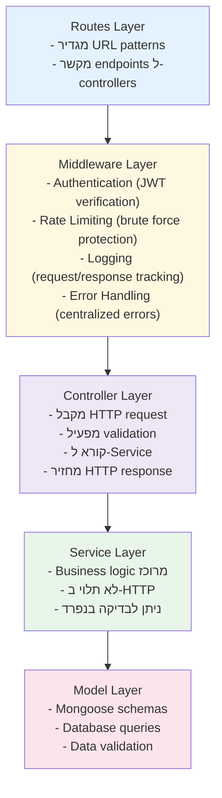

**למה בחרנו בארכיטקטורה זו?**

| יתרון | הסבר |
|-------|------|
| **Separation of Concerns** | כל שכבה אחראית לדבר אחד |
| **Testability** | אפשר לבדוק כל שכבה בנפרד |
| **Maintainability** | קל למצוא ולתקן באגים |
| **Scalability** | אפשר להחליף שכבות בלי לשנות אחרות |

### 1.3.7.5 חלוקה לתכניות ומודולים

```
server/
├── src/
│   ├── app.ts                    # Express app configuration
│   ├── server.ts                 # Server entry point
│   ├── swagger.ts                # Inline OpenAPI definition
│   │
│   ├── routes/                   # URL routing
│   │   ├── auth.routes.ts
│   │   ├── product.routes.ts
│   │   ├── cart.routes.ts
│   │   ├── order.routes.ts
│   │   ├── address.routes.ts
│   │   ├── health.routes.ts
│   │   ├── metrics.routes.ts
│   │   ├── payment.routes.ts
│   │   └── admin.routes.ts
│   │
│   ├── controllers/              # HTTP handlers
│   │   ├── auth.controller.ts
│   │   ├── product.controller.ts
│   │   ├── cart.controller.ts
│   │   ├── order.controller.ts
│   │   ├── address.controller.ts
│   │   ├── health.controller.ts
│   │   ├── payment.controller.ts
│   │   └── admin.controller.ts
│   │
│   ├── services/                 # Business logic
│   │   ├── auth.service.ts           # Login, register, tokenVersion
│   │   ├── googleAuth.service.ts     # Google OAuth verification
│   │   ├── product.service.ts        # CRUD, filtering
│   │   ├── cart.service.ts           # Cart management
│   │   ├── order.service.ts          # Order creation
│   │   ├── address.service.ts        # Address book management
│   │   ├── payment.service.ts        # Stripe integration
│   │   ├── payment-metrics.service.ts # Payment and webhook metrics
│   │   ├── webhook-retry.service.ts  # Retry failed webhooks
│   │   ├── audit-log.service.ts      # Audit trail helpers
│   │   ├── health.service.ts         # Health helpers
│   │   └── admin.service.ts          # Stats, management
│   │
│   ├── models/                   # Database schemas
│   │   ├── user.model.ts
│   │   ├── product.model.ts
│   │   ├── cart.model.ts
│   │   ├── address.model.ts
│   │   ├── order.model.ts
│   │   ├── payment.model.ts
│   │   ├── webhook-event.model.ts
│   │   ├── failed-webhook.model.ts
│   │   ├── idempotency-key.model.ts
│   │   ├── audit-log.model.ts
│   │   └── sequence.model.ts
│   │
│   ├── middlewares/              # Request processors
│   │   ├── auth.middleware.ts        # JWT verification
│   │   ├── rate-limiter.middleware.ts # Brute force protection
│   │   ├── error.middleware.ts       # Error handling
│   │   ├── logging.middleware.ts     # Request logging
│   │   ├── idempotency.middleware.ts # Duplicate prevention
│   │   ├── validate.middleware.ts    # Zod request validation
│   │   ├── validateObjectId.middleware.ts # ObjectId guards
│   │   ├── metrics.middleware.ts     # Request metrics
│   │   └── audit-logging.middleware.ts # Audit trail enrichment
│   │
│   ├── validators/               # Input validation (Zod)
│   │   ├── auth.validator.ts
│   │   ├── address.validator.ts
│   │   ├── order.validator.ts
│   │   ├── payment.validator.ts
│   │   └── index.ts
│   │
│   ├── config/                   # Configuration
│   │   ├── env.ts                    # Environment variables
│   │   ├── db.ts                     # MongoDB connection
│   │   ├── redisClient.ts            # Redis connection
│   │   ├── cors.ts                   # CORS settings
│   │   └── constants.ts              # Shared config constants
│   │
│   ├── utils/                    # Utilities
│   │   ├── logger.ts                 # Pino logger
│   │   ├── asyncHandler.ts           # Async + ApiError helper
│   │   ├── response.ts               # Response helpers
│   │   └── metrics.ts                # Metrics registry helpers
│   │
│   ├── types/
│   │   ├── express.ts
│   │   └── express-session.d.ts
│   │
│   └── __tests__/                # Test files
│       ├── auth.test.ts
│       ├── auth.test.google.ts
│       ├── products.test.ts
│       ├── health.test.ts
│       ├── order.test.ts
│       ├── payment-webhook.test.ts
│       ├── integration.test.ts
│       ├── performance.test.ts
│       └── test-setup.ts
│
├── docs/                         # Documentation
├── postman/                      # API collection
├── scripts/                      # Swagger/export helpers
├── SETUP.md
├── README.md
├── package.json
├── jest.config.js
└── tsconfig.json
```

### 1.3.7.6 סביבת השרת

| סביבה | שירות | תיאור |
|-------|-------|-------|
| **Production** | Render.com | PaaS, auto-deploy from GitHub |
| **Database** | MongoDB Atlas | Managed MongoDB cluster |
| **Cache** | Redis Cloud | Managed Redis instance |
| **Development** | Local | Node.js + MongoDB/Redis לפי הגדרות env |
| **Testing** | Mongo Memory Server | Jest against compiled `dist/__tests__` |

**API Base URL:** מוגדר דרך `process.env.API_URL`; ברירת מחדל מקומית ב-Swagger היא `http://localhost:4001`.

**Docs & Health Endpoints:**
- `/api/docs` - Swagger UI
- `/api/docs.json` - OpenAPI JSON
- `/health` - root health endpoint
- `/metrics` - Prometheus scrape endpoint

### 1.3.7.7 ממשק משתמש (GUI)

**הממשק מפותח בנפרד על ידי צד הלקוח** - ראה [חלק ג'](#2-צד-לקוח-frontend).

### 1.3.7.8 ממשקים למערכות אחרות (API)

#### External APIs

**1. Stripe API** - תשלומים
```
POST https://api.stripe.com/v1/checkout/sessions
  → יצירת session לתשלום
  
Webhook: POST /api/payments/webhook
  → קבלת אירועים (payment.succeeded, payment.failed)
```

#### Internal API - User / Public Endpoints

| Method | Endpoint | Auth | Input (main) | Output (main) | Typical errors |
|--------|----------|------|--------------|---------------|----------------|
| POST | `/api/auth/register` | No | `{ name, email, password }` | `{ success, data: { user, token, refreshToken } }` | 409 (email exists), 400 (validation) |
| POST | `/api/auth/login` | No | `{ email, password }` | `{ success, data: { user, token, refreshToken } }` | 401, 423 (account locked), 429 |
| POST | `/api/auth/google` | No | `{ idToken }` | `{ success, data: { user, token, refreshToken } }` | 400, 403, 429 |
| POST | `/api/auth/forgot-password` | No | `{ email }` | `{ success, message }` | 400, 429 |
| POST | `/api/auth/reset-password/:token` | No | `{ password, confirmPassword }` | `{ success, message }` | 400 |
| POST | `/api/auth/refresh` | No | `{ refreshToken }` | `{ success, data: { token, refreshToken } }` | 400, 401, 429 |
| GET | `/api/auth/verify` | Bearer | header `Authorization` | `{ success, data: { user } }` | 401 |
| GET | `/api/auth/profile` | Bearer | header `Authorization` | `{ success, data: { user } }` | 401 |
| PUT | `/api/auth/profile` | Bearer | `{ name?, email? }` | `{ success, data: { user }, message }` | 400, 401 |
| POST | `/api/auth/change-password` | Bearer | `{ currentPassword, newPassword, confirmPassword }` | `{ success, message }` | 400, 401 |
| POST | `/api/auth/logout` | Bearer | header `Authorization` | `{ success, message }` | 401 |
| GET | `/api/products` | No | query `category,minPrice,maxPrice,search,featured,sort` | `{ success, data: Product[] }` | 400 |
| GET | `/api/products/categories/list` | No | - | `{ success, data: string[] }` | 400 |
| GET | `/api/products/:id` | No | path `id` (ObjectId) | `{ success, data: Product }` | 400, 404 |
| GET | `/api/cart` | Bearer | header `Authorization` | `{ success, data: Cart }` | 401 |
| GET | `/api/cart/count` | Bearer | header `Authorization` | `{ success, data: { count } }` | 401 |
| POST | `/api/cart/add` | Bearer | `{ productId, quantity }` | `{ success, data: Cart, message }` | 400, 401 |
| PUT | `/api/cart/update` | Bearer | `{ productId, quantity }` | `{ success, data: Cart, message }` | 400, 401, 404 |
| DELETE | `/api/cart/remove` | Bearer | `{ productId }` | `{ success, data: Cart, message }` | 400, 401, 404 |
| DELETE | `/api/cart/clear` | Bearer | header `Authorization` | `{ success, data: { userId, items: [], total: 0 }, message }` | 401, 500 |
| POST | `/api/orders` | Bearer + idempotency | `{ shippingAddress, billingAddress?, paymentMethod?, notes? }` | `{ success, data: { order, payment }, message }` | 400, 401 |
| GET | `/api/orders` | Bearer | query `status?` | `{ success, data: { orders } }` | 401 |
| GET | `/api/orders/:orderId` | Bearer | path `orderId` | `{ success, data: { order } }` | 400, 401, 404 |
| POST | `/api/orders/:orderId/cancel` | Bearer | path `orderId` | `{ success, data: { order }, message }` | 400, 401, 404 |
| GET | `/api/orders/track/:orderId` | No | path `orderId` | `{ success, data: TrackingResponse }` | 400, 404, 429 |
| GET | `/api/addresses` | Bearer | header `Authorization` | `{ success, data: Address[] }` | 401 |
| GET | `/api/addresses/default` | Bearer | header `Authorization` | `{ success, data: Address }` | 401, 404 |
| GET | `/api/addresses/:addressId` | Bearer | path `addressId` | `{ success, data: Address }` | 400, 401, 404 |
| POST | `/api/addresses` | Bearer | `{ fullName, phone, street, city, postalCode, country, isDefault? }` | `{ success, data: Address, message }` | 400, 401 |
| PUT | `/api/addresses/:addressId` | Bearer | partial address fields | `{ success, data: Address, message }` | 400, 401, 404 |
| DELETE | `/api/addresses/:addressId` | Bearer | path `addressId` | `204 No Content` | 400, 401, 404 |
| POST | `/api/addresses/:addressId/set-default` | Bearer | path `addressId` | `{ success, data: Address, message }` | 400, 401, 404 |
| POST | `/api/payments/create-intent` | Bearer | `{ orderId }` | `{ success, data: { payment, status, clientSecret, checkoutUrl }, message }` | 400, 401, 404 |
| POST | `/api/payments/checkout` | Bearer | `{ orderId }` | `{ success, data: { payment, status, clientSecret, checkoutUrl }, message }` | 400, 401, 404 |
| GET | `/api/payments/:orderId/status` | Bearer | path `orderId` | `{ success, data: { orderPaymentStatus, paymentStatus, ... }, message }` | 400, 401, 404 |
| POST | `/api/payments/webhook` | No (Stripe signature) | raw body + `stripe-signature` header | `{ received: true }` | 400 |
| GET | `/api/health` | No | - | `{ success, data: { status, mongodb, redis, webhooks, uptime } }` | 500 |
| GET | `/api/health/ping` | No | - | `{ success, message: "pong", data: { time } }` | 500 |
| GET | `/api/metrics/payment` | Bearer | query `lastN?` | `{ success, data: PaymentMetrics }` | 401 |
| GET | `/api/metrics/webhook` | Bearer | query `lastN?` | `{ success, data: WebhookMetrics }` | 401 |
| GET | `/api/metrics/all` | Bearer | - | `{ success, data: ExportedMetrics }` | 401 |

#### Internal API - Admin Only Endpoints

כל המסלולים תחת `/api/admin/*` דורשים `requireAdmin`.

| Method | Endpoint | Input (main) | Output (main) | Typical errors |
|--------|----------|--------------|---------------|----------------|
| GET | `/api/admin/stats/summary` | - | `{ success, data: { stats } }` | 401, 403 |
| GET | `/api/admin/products` | query `includeInactive?` | `{ success, data: { products } }` | 401, 403 |
| POST | `/api/admin/products` | product payload | `{ success, data: { product } }` | 400, 401, 403 |
| PUT | `/api/admin/products/:id` | path `id`, patch payload | `{ success, data: { product } }` | 400, 401, 403, 404 |
| DELETE | `/api/admin/products/:id` | path `id` | `{ success, data: { product }, message }` | 400, 401, 403, 404 |
| GET | `/api/admin/users` | query `page?,limit?` | `{ success, data: { users, total, page, pages } }` | 401, 403 |
| PUT | `/api/admin/users/:id/role` | path `id`, body `{ role }` | `{ success, data: { user } }` | 400, 401, 403, 404 |
| GET | `/api/admin/orders` | query `status?,userId?` | `{ success, data: { orders } }` | 401, 403 |
| PUT | `/api/admin/orders/:id/status` | path `id`, body `{ status, message? }` | `{ success, data: { order } }` | 400, 401, 403, 404 |

#### Response Format

רוב ה-endpoints מחזירים מעטפת בסגנון הבא, אך לא כל ה-routes זהים לחלוטין. לדוגמה, `/health` מחזיר `success/status/timestamp`, בעוד ש-error responses עשויים לכלול גם `errors` ו-`code`.

```typescript
// Success
{
  success: true,
  data: { ... },
  message?: "Optional message"
}

// Error
{
  success: false,
  message: "Error description",
  errors?: [...],
  code?: "ERROR_CODE"
}
```

### 1.3.7.9 שימוש בחבילות תוכנה

#### Production Dependencies

| חבילה | גרסה | תפקיד |
|-------|------|-------|
| `express` | ^4.19 | HTTP server framework |
| `ioredis` | ^5.4 | Redis client |
| `stripe` | ^20.1 | Payment processing |
| `jsonwebtoken` | ^9.0 | JWT creation & verification |
| `google-auth-library` | ^10.x | Google OAuth token verification |
| `bcryptjs` | ^3.0 | Password hashing |
| `helmet` | ^8.1 | Security headers |
| `cors` | ^2.8 | Cross-origin support |
| `zod` | ^3.25 | Schema validation |
| `pino` | ^9.x | Structured logging |
| `prom-client` | ^15.0 | Prometheus metrics |

#### Dev Dependencies

| חבילה | גרסה | תפקיד |
|-------|------|-------|
| `mongoose` | ^8.x | MongoDB ODM (used by the app) |
| `typescript` | ^5.4 | Type checking |
| `jest` | ^29.7 | Testing framework |
| `supertest` | ^7.1 | HTTP testing |
| `ts-node` | ^10.9 | TypeScript execution |
| `ts-node-dev` | ^2.0 | Development auto-restart |
| `@types/*` | various | TypeScript definitions |

### 1.3.7.10 פונקציות מרכזיות

| פונקציה | קובץ | תיאור |
|---------|------|-------|
| `AuthService.login()` | `server/src/services/auth.service.ts` | אימות משתמש, בדיקת נעילה, יצירת JWT |
| `AuthService.logout()` | `server/src/services/auth.service.ts` | הגדלת tokenVersion לביטול כל הטוקנים |
| `AuthService.register()` | `server/src/services/auth.service.ts` | יצירת משתמש, hash סיסמה |
| `OrderService.createOrder()` | `server/src/services/order.service.ts` | יצירת הזמנה מעגלה |
| `PaymentService.createPaymentIntent()` | `server/src/services/payment.service.ts` | יצירת Stripe session |
| `PaymentService.handleWebhook()` | `server/src/services/payment.service.ts` | עיבוד webhook, idempotency, amount verification |
| `CartService.addToCart()` | `server/src/services/cart.service.ts` | הוספה לעגלה עם בדיקת מלאי |
| `ProductService.getProducts()` | `server/src/services/product.service.ts` | שליפה עם סינון |
| `AdminService.getStatsSummary()` | `server/src/services/admin.service.ts` | סטטיסטיקות מכירות ומלאי |
| `AuthMiddleware.requireAuth()` | `server/src/middlewares/auth.middleware.ts` | אימות JWT + tokenVersion |
| `authRateLimiter` | `server/src/middlewares/rate-limiter.middleware.ts` | הגנה מ-brute force |

---

## 1.3.8 מבני נתונים וארגון קבצים

### 1.3.8.1 פירוט מבני הנתונים

#### User Schema
```typescript
{
  _id: ObjectId,
  email: string,              // unique, indexed
  password?: string,          // bcrypt hashed, omitted for Google-only users
  name: string,
  role: "user" | "admin",
  isActive: boolean,
  lastUpdated?: Date,
  tokenVersion: number,       // ++ on logout, invalidates all tokens
  failedLoginAttempts: number,
  lockedUntil?: Date | null,
  lastLogin?: Date,
  resetPasswordToken?: string,
  resetPasswordExpires?: Date,
  googleId?: string | null,
  avatar?: string | null,
  createdAt: Date,
  updatedAt: Date
}
```

#### Product Schema
```typescript
{
  _id: ObjectId,
  sku: string,                // unique
  name: string,
  description: string,
  price: number,
  stock: number,
  category: string,           // indexed
  // Valid categories: accessories, audio, displays, laptops,
  //   smart-home, smartphones, streaming, tablets, wearables
  image: string,
  featured: boolean,
  rating: number,
  isActive: boolean,          // soft delete flag
  createdAt: Date,
  updatedAt: Date
}
```

#### Cart Schema
```typescript
{
  _id: ObjectId,
  userId: ObjectId,           // ref: User, unique
  items: [{
    product: ObjectId,        // ref: Product
    quantity: number,
    lockedPrice: number | null
  }],
  total: number,
  createdAt: Date,
  updatedAt: Date
}
```

#### Address Schema
```typescript
{
  _id: ObjectId,
  user: string,
  fullName: string,
  phone: string,
  street: string,
  city: string,
  postalCode: string,
  country: string,
  isDefault: boolean,
  createdAt: Date,
  updatedAt: Date
}
```

#### Order Schema
```typescript
{
  _id: ObjectId,
  orderNumber: string,        // unique, format: ORD-YYYYMMDD-XXX
  user: string,               // ref: User
  items: [{
    product: string,
    name: string,             // snapshot at order time
    price: number,            // snapshot at order time
    quantity: number,
    image?: string
  }],
  totalAmount: number,
  status: "pending" | "pending_payment" | "confirmed" | "processing" | "shipped" | "delivered" | "cancelled",
  paymentStatus: "pending" | "paid" | "failed" | "refunded",
  paymentMethod: "credit_card" | "paypal" | "cash_on_delivery" | "stripe",
  shippingAddress: {
    fullName: string,
    phone: string,
    street: string,
    city: string,
    postalCode: string,
    country: string
  },
  billingAddress?: {
    street: string,
    city: string,
    postalCode: string,
    country: string
  },
  trackingHistory: Array<{ status: string; timestamp: Date; message?: string }>,
  estimatedDelivery?: Date,
  notes?: string,
  paymentIntentId?: string,
  paymentIntentStripeId?: string,
  paymentVerifiedAt?: Date,
  paymentProvider?: "stripe" | "paypal" | "mock",
  fulfilled: boolean,
  fulfilledAt?: Date,
  createdAt: Date,
  updatedAt: Date
}
```

#### Payment Schema
```typescript
{
  _id: ObjectId,
  order: string,              // ref: Order
  user: string,               // ref: User
  amount: number,
  currency: string,
  status: "pending" | "requires_action" | "succeeded" | "failed" | "refunded" | "canceled",
  provider: string,
  providerPaymentId?: string,
  paymentIntentId?: string,
  clientSecret?: string,
  checkoutUrl?: string,
  meta?: Record<string, any>,
  createdAt: Date,
  updatedAt: Date
}
```

#### WebhookEvent Schema (Idempotency)
```typescript
{
  _id: ObjectId,
  eventId: string,            // unique, from Stripe
  provider: "stripe" | "paypal",
  eventType: string,
  processedAt: Date,
  metadata?: any,
  createdAt: Date,
  updatedAt: Date
}
```

#### FailedWebhook Schema
```typescript
{
  _id: ObjectId,
  eventId: string,
  eventType: string,
  provider: "stripe" | "paypal",
  payload: any,
  error: string,
  retryCount: number,
  maxRetries: number,
  nextRetryAt: Date,
  lastAttemptAt: Date,
  status: "pending" | "retrying" | "failed" | "succeeded",
  createdAt: Date,
  updatedAt: Date
}
```

### 1.3.8.2 שיטת האחסון

| סוג מידע | טכנולוגיה | סיבה |
|----------|----------|------|
| **Primary Data** | MongoDB Atlas | Document-based, scalable, transactions |
| **Sessions/Cache** | Redis Cloud | Fast, in-memory, TTL support |
| **Files/Images** | External URLs | לא מאחסנים קבצים, רק URLs |
| **Logs** | Pino → stdout | Render.com collects automatically |

### 1.3.8.3 מנגנוני התאוששות

#### Startup Recovery Strategy
```typescript
try {
  await connectMongo();
} catch (err) {
  logger.warn({ err }, "Continuing without Mongo connection for health readiness");
}

try {
  await connectRedis();
} catch (err) {
  logger.warn({ err }, "Continuing without Redis connection for health readiness");
}
```

#### Transaction Rollback
```typescript
// Atomic stock reduction - all or nothing
const session = await mongoose.startSession();
session.startTransaction();
try {
  await Product.updateOne(
    { _id: productId, stock: { $gte: quantity } },
    { $inc: { stock: -quantity } },
    { session }
  );
  await session.commitTransaction();
} catch (error) {
  await session.abortTransaction();
  throw error;
}
```

#### Webhook Retry Logic
```typescript
// Idempotency - prevent duplicate processing
const existing = await WebhookEvent.findOne({ eventId });
if (existing) {
  return { status: 'already_processed' };
}
// Process and save eventId
await WebhookEvent.create({ eventId, processedAt: new Date() });
```

---

## 1.3.9 תרשימי מערכת

### 1.3.9.0 Database ER Diagram (Mermaid)

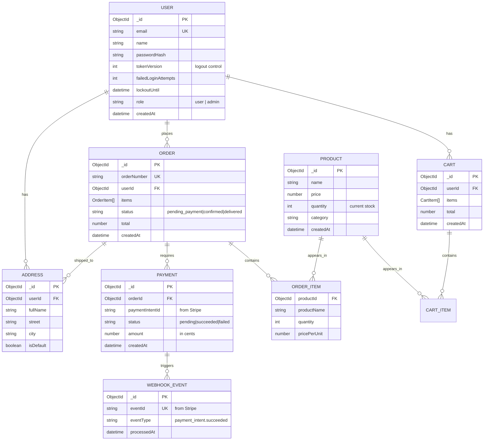

**Schema Relationships:**
- **1:N User → Order/Cart/Address** - User can have many orders, carts, addresses
- **N:N Product ↔ Cart/Order (through CartItem/OrderItem)** - Products appear in carts/orders with quantity snapshot
- **1:1 Order → Payment** - Each order has exactly one payment record
- **1:N Payment → WebhookEvent** - Payment can trigger multiple webhook attempts (with idempotency tracking)

---

### 1.3.9.1 Use Case Diagram (Mermaid)

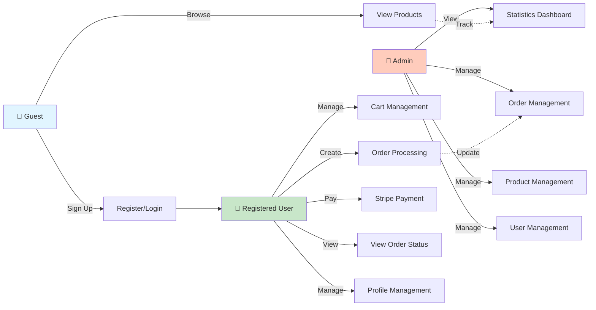

### 1.3.9.2 Sequence Diagram - Checkout Flow (Mermaid)

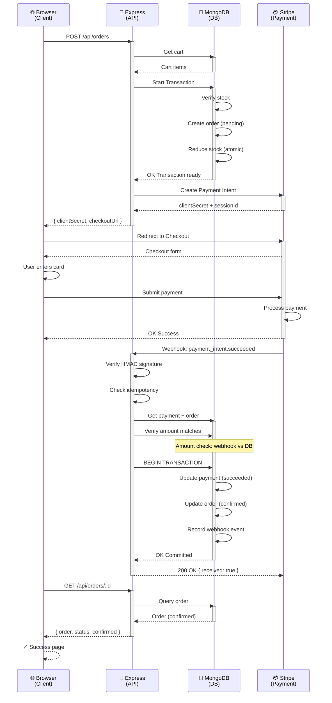

### 1.3.9.3 Data Flow Diagram (Mermaid) - Full Order Flow

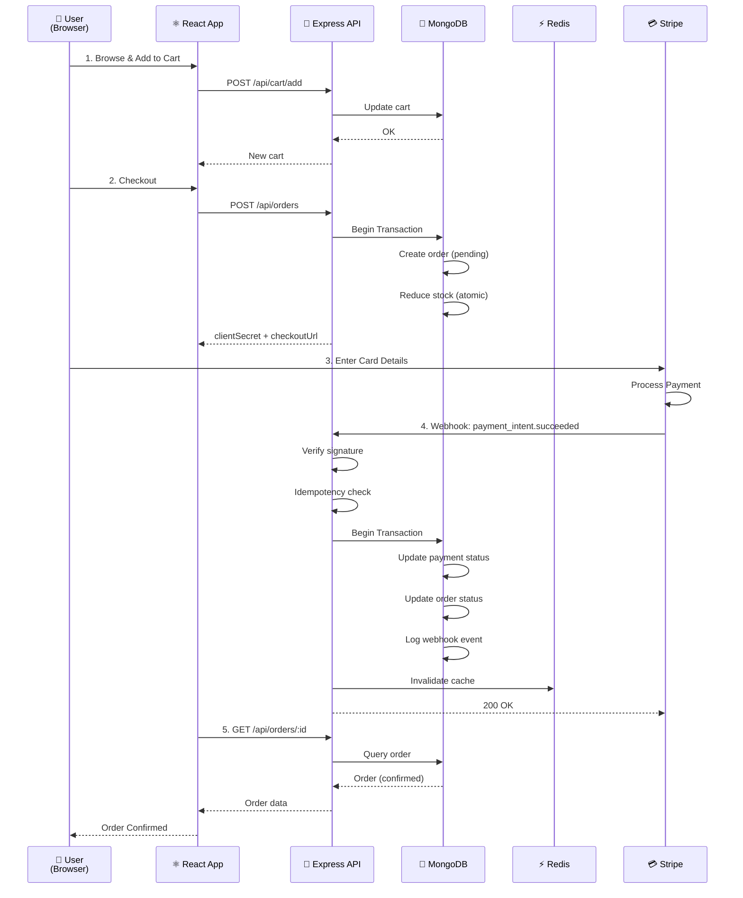

### 1.3.9.7 System Context & Data Flow (Mermaid)

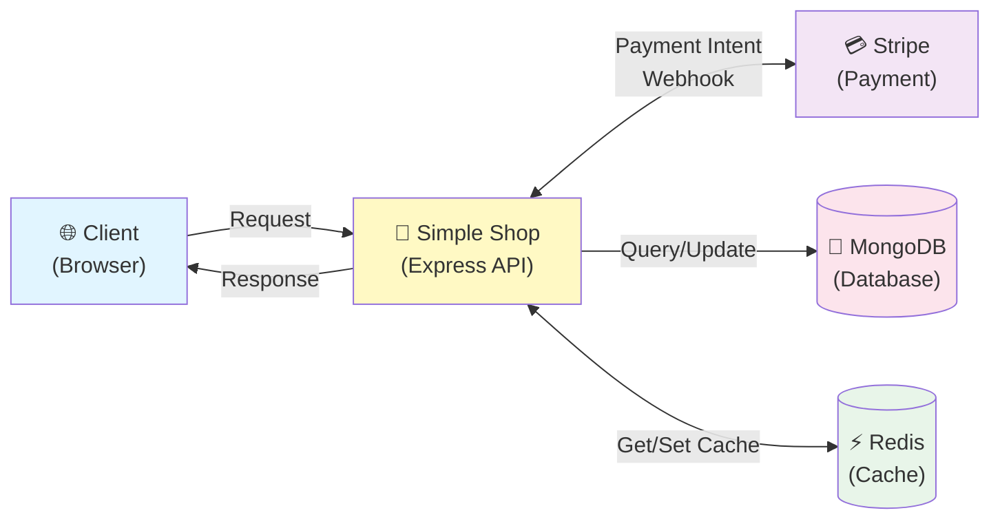

**System Architecture (Top-Level Flows):**

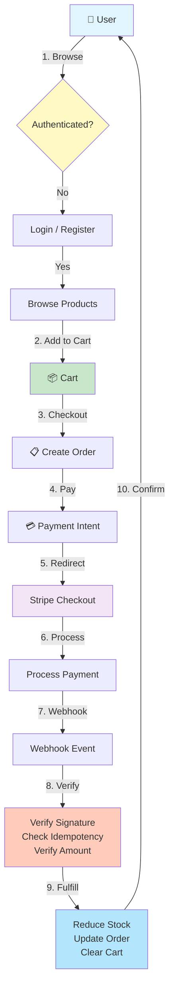

### 1.3.9.4 Login Flow with tokenVersion (Mermaid)

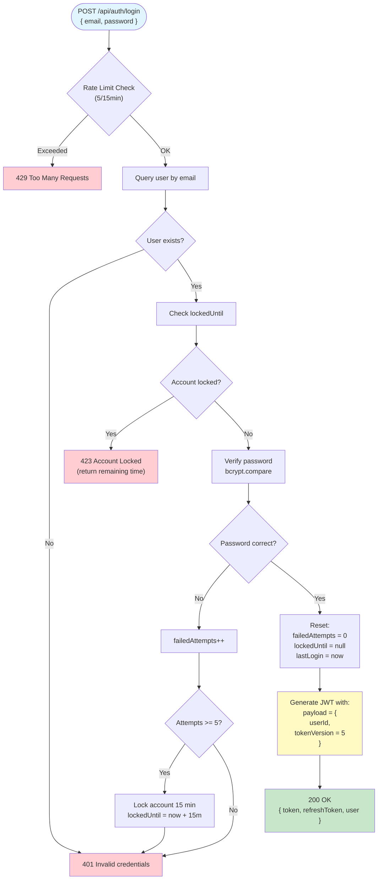

### 1.3.9.5 Webhook Security Flow (Mermaid)

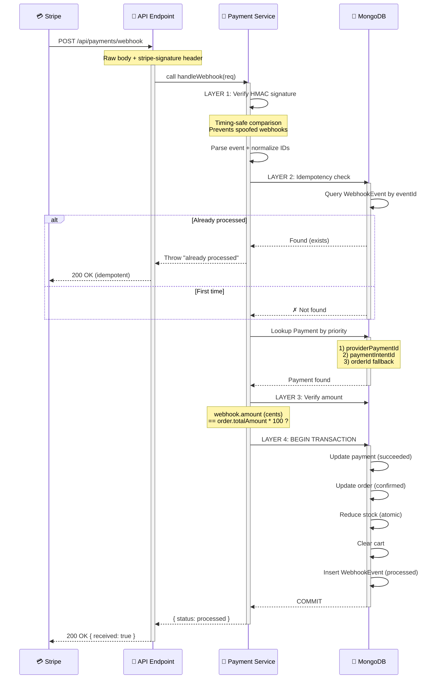

### 1.3.9.6 Logout Flow - Instant Token Revocation (Mermaid)

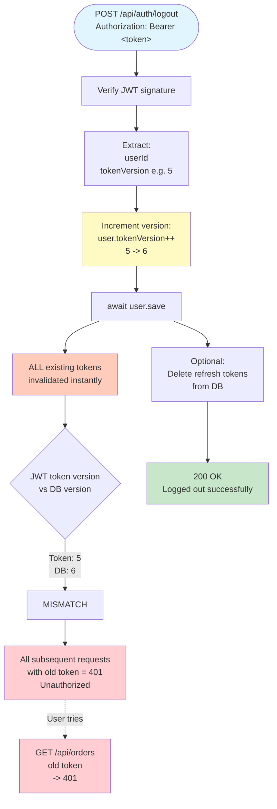

---

## 1.3.10 מרכיב אלגוריתמי

### 1.3.10.1 בעיות ופתרונות אלגוריתמיים

#### בעיה 1: Race Condition במכירת מוצרים

**הבעיה:**
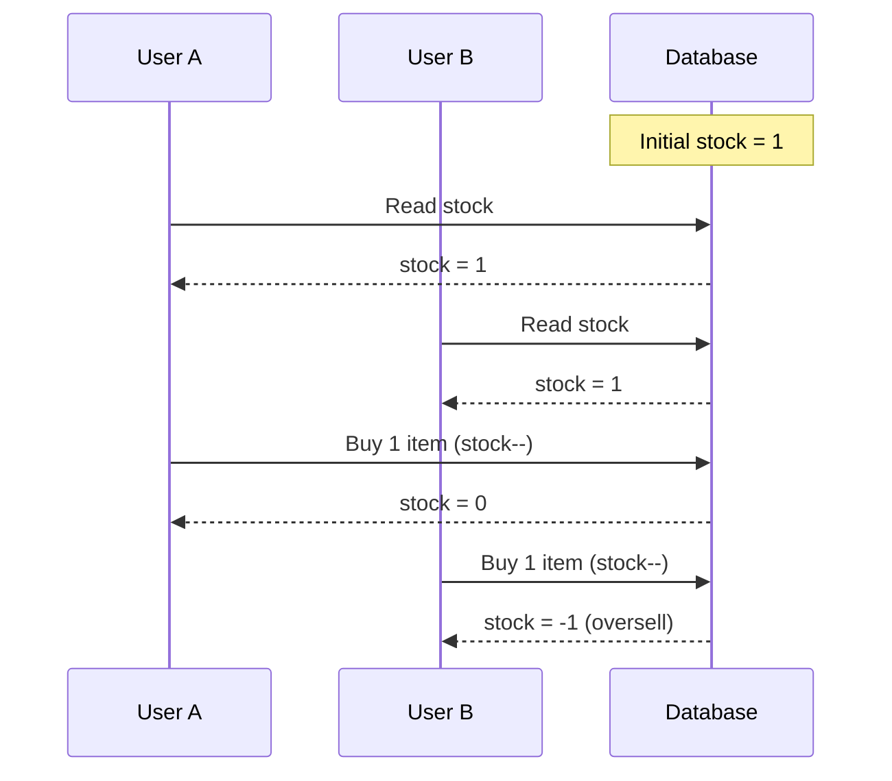

**הפתרון: MongoDB Atomic Update**
```typescript
// במקום:
const product = await Product.findById(id);
if (product.stock >= quantity) {
  product.stock -= quantity;  // ❌ Not atomic!
  await product.save();
}

// עשינו:
const result = await Product.findOneAndUpdate(
  { 
    _id: id, 
    stock: { $gte: quantity }  // Condition in query
  },
  { 
    $inc: { stock: -quantity }  // Atomic decrement
  },
  { new: true }
);

if (!result) {
  throw new Error('Insufficient stock');
}
```

**סיבוכיות:** O(1) - single atomic operation

---

#### בעיה 2: ביטול מיידי של כל הטוקנים (Logout)

**הבעיה:**  
משתמש מתנתק, אבל JWT tokens שכבר הופקו עדיין תקפים עד שיפוגו.

**פתרונות אפשריים:**

| פתרון | יתרון | חיסרון |
|-------|-------|--------|
| Token Blacklist | פשוט | DB lookup בכל בקשה |
| Short Expiry | פשוט | UX רע (login תכוף) |
| **tokenVersion** | מהיר, ללא DB lookup נוסף | צריך לשמור version |

**הפתרון שבחרנו: tokenVersion**

```typescript
// ב-User Schema:
tokenVersion: { type: Number, default: 0 }

// ב-Login - JWT payload כולל את הגרסה:
const token = jwt.sign({
  userId: user._id,
  tokenVersion: user.tokenVersion  // e.g., 5
}, secret);

// ב-Logout - מגדילים את הגרסה:
user.tokenVersion += 1;  // Now 6
await user.save();

// ב-Auth Middleware - בודקים התאמה:
const decoded = jwt.verify(token, secret);
const user = await User.findById(decoded.userId);

if (decoded.tokenVersion !== user.tokenVersion) {
  throw new Error('Token revoked');  // 5 !== 6
}
```

**סיבוכיות:** O(1) - comparison operation

---

#### בעיה 3: Webhook Replay Attack

**הבעיה:**  
Stripe שולח webhook פעמיים (network issue, retry) → חיוב כפול / stock כפול

**הפתרון: Idempotency Tracking + Duplicate Guard**

```typescript
async function handleWebhook(req: Request) {
  const result = await provider.handleWebhook(req); // signature verified

  const existingEvent = await WebhookEventModel.findOne({
    eventId: result.providerPaymentId,
    provider: provider.name,
  });

  if (existingEvent) {
    throw new Error(`Webhook event ${result.providerPaymentId} already processed`);
  }

  // payment lookup + amount verification + fulfillment flow...

  await WebhookEventModel.create({
    eventId: result.providerPaymentId,
    eventType: result.status,
    provider: provider.name,
    metadata: result.raw,
  });
}
```

ב-`PaymentController.webhook` כפילות מזוהה מוחזרת כ-`200` עם הודעת `Duplicate event ignored`, כך ש-Stripe לא ימשיך לנסות לעבד את אותו אירוע שוב ושוב.

**סיבוכיות:** O(1) lookup + O(1) insert (עם אינדקס על `eventId`/provider)

---

### 1.3.10.2 איסוף מידע וסטטיסטיקות

#### Metrics נאספים

| Metric | מקור | שימוש |
|--------|------|-------|
| Response Time | prom-client | זיהוי צווארי בקבוק |
| Error Rate | Error middleware | התראות |
| Failed Logins | Auth service | זיהוי התקפות |
| Stock Levels | Product model | התראת מלאי נמוך |
| Payment Success Rate | Payment service | בריאות עסקית |

#### Admin Stats Endpoint

```typescript
// GET /api/admin/stats/summary
{
  sales: {
    total: 12345.67,        // סה"כ מכירות (delivered)
    deliveredCount: 45
  },
  orders: {
    open: 8,                // הזמנות פתוחות
    today: 3
  },
  inventory: {
    lowStockCount: 5,
    lowStockProducts: [     // מוצרים עם stock < 5
      { _id, name, stock }
    ],
    activeProducts: 50
  },
  users: {
    total: 150
  }
}
```

#### Logging Format (Structured)

```json
{
  "level": "info",
  "time": 1709308800000,
  "service": "PaymentService",
  "method": "handleWebhook",
  "eventId": "evt_1abc123",
  "eventType": "checkout.session.completed",
  "orderId": "ORD-20260301-001",
  "amount": 199.99,
  "duration_ms": 45,
  "status": "success"
}
```

---

## 1.3.11 אבטחת מידע

### אזורים הדורשים הגנה

| אזור | איומים | הגנות |
|------|--------|-------|
| **Authentication** | Brute force, Credential stuffing | Rate limit, Account lockout, bcrypt |
| **Sessions** | Token theft, Session fixation | JWT, tokenVersion, HTTPS only |
| **API** | Injection, XSS, CSRF | Zod validation, Helmet, CORS |
| **Database** | SQL injection, Data leak | Mongoose ODM, select: false |
| **Payments** | Webhook spoofing, Replay | HMAC verification, Idempotency |

### מנגנוני ההגנה המיושמים

#### 1. Password Security
```typescript
// Hash with bcrypt (12 rounds = ~250ms)
const hash = await bcrypt.hash(password, 12);

// Verify
const isValid = await bcrypt.compare(password, hash);
```

#### 2. JWT with tokenVersion
```typescript
// Token payload
{
  userId: "507f1f77bcf86cd799439011",
  tokenVersion: 5,  // Must match DB
  iat: 1709308800,
  exp: 1709312400   // 1 hour
}

// Verification includes version check
if (decoded.tokenVersion !== user.tokenVersion) {
  throw new UnauthorizedError('Token revoked');
}
```

#### 3. Rate Limiting
```typescript
// Auth endpoints: 5 requests per 15 minutes per user
const authLimiter = rateLimit({
  windowMs: 15 * 60 * 1000,
  max: 5,
  keyGenerator: (req) => req.body.email || req.ip
});

// General API: 100 requests per minute
const apiLimiter = rateLimit({
  windowMs: 60 * 1000,
  max: 100
});
```

#### 4. Account Lockout
```typescript
if (user.failedLoginAttempts >= 5) {
  user.lockedUntil = new Date(Date.now() + 15 * 60 * 1000);
  throw new Error('Account locked for 15 minutes');
}
```

#### 5. Webhook Signature Verification
```typescript
const signature = req.headers['stripe-signature'];
const event = stripe.webhooks.constructEvent(
  req.body,
  signature,
  process.env.STRIPE_WEBHOOK_SECRET
);
// Throws if signature invalid
```

### 5 תרחישי התקפה ותגובה

| # | התקפה | תגובה | קוד שגיאה |
|---|-------|-------|-----------|
| 1 | Brute force login (100 ניסיונות) | Account locked, logged, IP rate limited | 429/423 |
| 2 | SQL Injection in email field | Zod validation rejects, query parameterized | 400 |
| 3 | Stolen JWT token used | tokenVersion mismatch after logout | 401 |
| 4 | Fake Stripe webhook | HMAC signature verification fails | 400 |
| 5 | Same webhook sent twice | Idempotency check blocks duplicate | 200 (skip) |

---

## 1.3.12 קטעי קוד מרכזיים - ליבה של הפרויקט

### 1.3.12.1 מודל User - אימות וניהול חשבון

```typescript
// user.model.ts - Schema עם bcrypt hashing ו-tokenVersion
import { Schema, model, Document } from "mongoose";
import bcrypt from "bcryptjs";

export interface IUser extends Document {
  _id: string;
  email: string;
  password?: string;
  name: string;
  role: "user" | "admin";
  createdAt: Date;
  updatedAt: Date;
  isActive: boolean;
  lastLogin?: Date;
  failedLoginAttempts: number;
  lockedUntil?: Date | null;
  tokenVersion: number;  // ← KEY: Invalidates all tokens on logout
  googleId?: string | null;
  avatar?: string | null;
  comparePassword(candidatePassword: string): Promise<boolean>;
}

const UserSchema = new Schema<IUser>(
  {
    email: {
      type: String,
      required: [true, "Email is required"],
      unique: true,
      lowercase: true,
      trim: true,
    },
    password: {
      type: String,
      required: function (this: any) {
        return !this.googleId;  // Only required for non-OAuth users
      },
      minlength: [6, "Password must be at least 6 characters"],
      select: false,  // 🔒 Don't include by default in queries
    },
    name: {
      type: String,
      required: [true, "Name is required"],
      trim: true,
      minlength: [2, "Name must be at least 2 characters"],
    },
    role: {
      type: String,
      enum: ["user", "admin"],
      default: "user",
    },
    isActive: {
      type: Boolean,
      default: true,
    },
    lastLogin: {
      type: Date,
    },
    failedLoginAttempts: {
      type: Number,
      default: 0,
      min: 0,
    },
    lockedUntil: {
      type: Date,
      default: null,
      index: true,  // For efficient lockout queries
    },
    tokenVersion: {
      type: Number,
      default: 0,
    },
    googleId: {
      type: String,
      default: null,
      index: true,
      sparse: true,
    },
    avatar: {
      type: String,
      default: null,
    },
  },
  {
    timestamps: true,
    toJSON: {
      transform: function (doc, ret) {
        delete (ret as any).password;
        delete (ret as any).failedLoginAttempts;
        delete (ret as any).lockedUntil;
        delete (ret as any).__v;
        return ret;
      },
    },
  },
);

// 🔐 Pre-save middleware: Hash password with bcrypt (12 rounds ~250ms)
UserSchema.pre("save", async function (next) {
  if (!this.isModified("password") || !this.password) {
    return next();
  }
  try {
    const salt = await bcrypt.genSalt(12);
    this.password = await bcrypt.hash(this.password, salt);
    next();
  } catch (error) {
    next(error as Error);
  }
});

// 🔍 Instance method: Compare input password with stored hash
UserSchema.methods.comparePassword = async function (
  candidatePassword: string,
): Promise<boolean> {
  if (!this.password) return false;
  try {
    return await bcrypt.compare(candidatePassword, this.password);
  } catch (error) {
    throw new Error("Password comparison failed");
  }
};

export const UserModel = model<IUser>("User", UserSchema);
```

**מרכיבים חשובים:**
- `password: { select: false }` - שדה סודי, לא נשלח בשאילתות בברירת מחדל
- `bcrypt.hash(..., 12)` - 12 rounds = ~250ms זמן עיבוד, מונע brute-force
- `tokenVersion: number` - כל גדלת הגרסה מבטלת את כל ה-tokens
- `lockedUntil: Date with index` - חיפוש מהיר של משתמשים נעולים

---

### 1.3.12.2 מודל Order - הזמנה עם מעקב

```typescript
// order.model.ts - Schema הזמנה עם nested items ו-tracking history
import { Schema, model, Document } from "mongoose";

export interface IOrder extends Document {
  _id: string;
  orderNumber: string;
  user: string;  // Reference to User
  items: Array<{
    product: string;
    name: string;
    price: number;
    quantity: number;
    image?: string;
  }>;
  totalAmount: number;
  status: "pending" | "pending_payment" | "confirmed" | "processing" | "shipped" | "delivered" | "cancelled";
  paymentStatus: "pending" | "paid" | "failed" | "refunded";
  paymentMethod: string;
  shippingAddress: {
    fullName: string;
    phone: string;
    street: string;
    city: string;
    postalCode: string;
    country: string;
  };
  trackingHistory: Array<{
    status: string;
    timestamp: Date;
    message?: string;
  }>;
  paymentIntentId?: string;
  paymentIntentStripeId?: string;  // Real Stripe pi_... ID
  paymentVerifiedAt?: Date;
  fulfilled?: boolean;
  createdAt: Date;
  updatedAt: Date;
}

const OrderSchema = new Schema<IOrder>(
  {
    orderNumber: {
      type: String,
      required: true,
      unique: true,
      index: true,
    },
    user: {
      type: String,
      required: true,
      ref: "User",
      index: true,
    },
    items: [
      {
        product: {
          type: String,
          ref: "Product",
          required: true,
        },
        name: { type: String, required: true },
        price: { type: Number, required: true, min: 0 },
        quantity: { type: Number, required: true, min: 1 },
        image: String,
      },
    ],
    totalAmount: {
      type: Number,
      required: true,
      min: 0,
    },
    status: {
      type: String,
      enum: [
        "pending",
        "pending_payment",
        "confirmed",
        "processing",
        "shipped",
        "delivered",
        "cancelled",
      ],
      default: "pending",
      index: true,
    },
    paymentStatus: {
      type: String,
      enum: ["pending", "paid", "failed", "refunded"],
      default: "pending",
    },
    paymentMethod: {
      type: String,
      required: true,
      enum: ["credit_card", "paypal", "cash_on_delivery", "stripe"],
    },
    shippingAddress: {
      fullName: { type: String, required: true },
      phone: { type: String, required: true },
      street: { type: String, required: true },
      city: { type: String, required: true },
      postalCode: { type: String, required: true },
      country: { type: String, default: "Israel" },
    },
    trackingHistory: [
      {
        status: {
          type: String,
          enum: [
            "pending",
            "pending_payment",
            "confirmed",
            "processing",
            "shipped",
            "delivered",
            "cancelled",
          ],
          required: true,
        },
        timestamp: { type: Date, default: Date.now },
        message: String,
      },
    ],
    paymentIntentId: String,
    paymentIntentStripeId: String,
    paymentVerifiedAt: Date,
    fulfilled: { type: Boolean, default: false },
  },
  {
    timestamps: true,
  },
);

export const OrderModel = model<IOrder>("Order", OrderSchema);
```

**מרכיבים חשובים:**
- `items: [{ product, name, price, quantity }]` - Nested array (denormalization לביצועים)
- `trackingHistory: [{ status, timestamp, message }]` - היסטוריה של שינויים בהזמנה
- `paymentIntentStripeId: string` - ID אמיתי מ-Stripe לתחקור webhook
- `fulfilled: boolean` - סימון גם בוואן ניטענו המוצרים מהמלאי (אטומי)

---

### 1.3.12.3 Payment Service - Webhook Handler (המשך בעמוד הבא)

```typescript
// payment.service.ts - handleWebhook() - הקור של בטיחות התשלום
static async handleWebhook(req: Request) {
  const provider = this.getProvider();
  
  // ✅ LAYER 1: Signature verification (inside provider)
  const result = await provider.handleWebhook(req);
  
  // ✅ LAYER 2: Idempotency check - prevent duplicate processing
  const existingEvent = await WebhookEventModel.findOne({
    eventId: result.providerPaymentId,
    provider: provider.name,
  });
  
  if (existingEvent) {
    // Event already processed - return success so Stripe stops retrying
    throw new Error(`Webhook event ${result.providerPaymentId} already processed`);
  }
  
  // 🔍 Find payment in database
  let payment = await PaymentModel.findOne({
    providerPaymentId: result.providerPaymentId,
  });
  
  // Fallback: Try payment_intent ID
  if (!payment && result.providerPaymentIntentId) {
    payment = await PaymentModel.findOne({
      $or: [
        { paymentIntentId: result.providerPaymentIntentId },
        { "meta.payment_intent": result.providerPaymentIntentId },
      ],
    });
  }
  
  // Fallback: Try orderId
  if (!payment && result.orderId) {
    payment = await PaymentModel.findOne({ order: result.orderId })
      .sort({ createdAt: -1 });
  }
  
  if (!payment) {
    throw new Error(
      `Payment not found for provider ID: ${result.providerPaymentId}`
    );
  }
  
  // ✅ LAYER 3: Amount verification - CRITICAL security check
  // Ensure webhook amount matches order amount in OUR database
  const order = await OrderModel.findById(payment.order);
  if (!order) {
    throw new Error(`Order not found: ${payment.order}`);
  }
  
  // Amount from webhook (in cents/smallest unit)
  const webhookAmount = result.amount;
  // Amount from our database (in cents)
  const expectedAmount = Math.round(order.totalAmount * 100);
  
  if (webhookAmount !== expectedAmount) {
    log.error("❌ Amount mismatch - potential attack!", {
      webhookAmount,
      expectedAmount,
      orderId: order._id,
    });
    throw new Error(
      `Amount mismatch: webhook says ${webhookAmount}, expected ${expectedAmount}`
    );
  }
  
  // ✅ LAYER 4: Atomic transaction - reduce stock atomically
  const session = await mongoose.startSession();
  session.startTransaction();
  
  try {
    // Update payment status
    payment.status = mapToOrderStatus(result.status);
    payment.paymentVerifiedAt = new Date();
    payment.meta = result.raw;
    await payment.save({ session });
    
    // Update order status
    order.paymentStatus = mapToOrderPaymentStatus(result.status);
    order.status = "confirmed";  // Payment confirmed → ready to process
    order.trackingHistory.push({
      status: "confirmed",
      timestamp: new Date(),
      message: "Payment verified by Stripe webhook",
    });
    await order.save({ session });
    
    // Reduce stock atomically for each item
    for (const item of order.items) {
      const result = await ProductModel.findOneAndUpdate(
        {
          _id: item.product,
          stock: { $gte: item.quantity }  // ← Condition in query
        },
        {
          $inc: { stock: -item.quantity }  // ← Atomic decrement
        },
        { new: true, session }
      );
      
      if (!result) {
        throw new Error(
          `Insufficient stock for product ${item.product}`
        );
      }
    }
    
    // Mark webhook as processed (idempotency)
    await WebhookEventModel.create(
      [
        {
          eventId: result.providerPaymentId,
          eventType: result.eventType,
          provider: provider.name,
          orderId: order._id,
          processedAt: new Date(),
        },
      ],
      { session }
    );
    
    await session.commitTransaction();
    
    log.info("✅ Webhook processed successfully", {
      orderId: order._id,
      amount: webhookAmount,
    });
    
  } catch (error) {
    await session.abortTransaction();
    throw error;
  } finally {
    session.endSession();
  }
  
  return {
    eventType: result.eventType,
    status: "processed",
  };
}
```

**שכבות בטיחות:**
- **Layer 1 (Signature):** Stripe חותמת ב-HMAC-SHA256 → אנחנו מאמתים חתימה
- **Layer 2 (Idempotency):** Track `eventId` ב-DB → אם כבר ראינו את הイחועה, דילג
- **Layer 3 (Amount):** חזק חתימה בדוק שהסכום מתאים ל-DB שלנו (הגנה מפני compromised Stripe)
- **Layer 4 (Transactions):** MongoDB transaction → אם stock נגמר, rollback הכל

---

### 1.3.12.4 Auth Controller - Login עם Account Lockout

```typescript
// auth.controller.ts - Login method with rate limiting & lockout
static login = asyncHandler(async (req: Request, res: Response) => {
  const { email, password } = req.body;
  
  // Find user by email
  const user = await UserModel.findByEmail(email).select("+password");
  
  if (!user) {
    return sendError(res, 401, "Invalid email or password");
  }
  
  // ✅ Check if account is locked
  if (user.lockedUntil && user.lockedUntil > new Date()) {
    const remainingMinutes = Math.ceil(
      (user.lockedUntil.getTime() - Date.now()) / 60000
    );
    log.warn("Account locked - login attempt", {
      email,
      remainingMinutes,
    });
    return sendError(
      res,
      423,  // 423 Locked
      `Account locked. Try again in ${remainingMinutes} minutes.`
    );
  }
  
  // ✅ Compare password
  const isPasswordValid = await user.comparePassword(password);
  
  if (!isPasswordValid) {
    // Increment failed attempts
    user.failedLoginAttempts += 1;
    
    // Lock account if 5 failed attempts
    if (user.failedLoginAttempts >= 5) {
      user.lockedUntil = new Date(Date.now() + 15 * 60 * 1000);  // 15 minutes
      log.error("Account locked - too many attempts", {
        email,
        attempts: user.failedLoginAttempts,
      });
    }
    
    await user.save();
    
    return sendError(res, 401, "Invalid email or password");
  }
  
  // ✅ Password correct - reset failed attempts
  user.failedLoginAttempts = 0;
  user.lockedUntil = null;
  user.lastLogin = new Date();
  await user.save();
  
  // ✅ Generate JWT with tokenVersion
  const token = jwt.sign(
    {
      userId: user._id,
      tokenVersion: user.tokenVersion,  // ← Include version
    },
    process.env.JWT_SECRET!,
    { expiresIn: "1h" }
  );
  
  // Generate refresh token
  const refreshToken = jwt.sign(
    {
      userId: user._id,
      tokenVersion: user.tokenVersion,
    },
    process.env.REFRESH_TOKEN_SECRET!,
    { expiresIn: "7d" }
  );
  
  // Store refresh token in database or Redis
  await RefreshTokenModel.create({
    userId: user._id,
    token: refreshToken,
    expiresAt: new Date(Date.now() + 7 * 24 * 60 * 60 * 1000),
  });
  
  return sendSuccess(
    res,
    {
      user: user.toJSON(),
      token,
      refreshToken,
    },
    "Login successful",
    200
  );
});

// ✅ Logout - invalidate all tokens by incrementing tokenVersion
static logout = asyncHandler(async (req: Request, res: Response) => {
  const userId = req.userId;
  
  const user = await UserModel.findById(userId);
  if (!user) {
    return sendError(res, 404, "User not found");
  }
  
  // Increment version → All existing tokens become invalid
  user.tokenVersion += 1;
  await user.save();
  
  // Optional: Delete refresh tokens
  await RefreshTokenModel.deleteMany({ userId });
  
  log.info("User logged out", {
    userId,
    newTokenVersion: user.tokenVersion,
  });
  
  return sendSuccess(res, null, "Logout successful", 200);
});
```

**מנגנוני הגנה:**
- `lockedUntil` - נעילת 15 דקות לאחר 5 ניסיונות כושלים
- `tokenVersion` - כל logout מגביר את הגרסה → כל הטוקנים הישנים בטלים מיידית
- `refreshToken` - Stored in DB, ניתן למחוק כל הטוקנים של משתמש בבת אחת

---

### 1.3.12.5 Order Service - Create Order עם MongoDB Transaction

```typescript
// order.service.ts - Create order with atomic stock reduction
static async createOrder(userId: string, cartId: string) {
  const user = await UserModel.findById(userId);
  if (!user) throw new Error("User not found");
  
  const cart = await CartModel.findById(cartId);
  if (!cart || cart.user.toString() !== userId) {
    throw new Error("Cart not found");
  }
  
  if (cart.items.length === 0) {
    throw new Error("Cart is empty");
  }
  
  // ✅ Start atomic transaction
  const session = await mongoose.startSession();
  session.startTransaction();
  
  try {
    // Calculate total amount
    let totalAmount = 0;
    const orderItems = [];
    
    // Verify stock for all items
    for (const cartItem of cart.items) {
      const product = await ProductModel.findById(cartItem.product).session(session);
      
      if (!product) {
        throw new Error(`Product not found: ${cartItem.product}`);
      }
      
      if (product.stock < cartItem.quantity) {
        throw new Error(
          `Insufficient stock for ${product.name}. Available: ${product.stock}, Requested: ${cartItem.quantity}`
        );
      }
      
      totalAmount += product.price * cartItem.quantity;
      
      orderItems.push({
        product: product._id,
        name: product.name,
        price: product.price,
        quantity: cartItem.quantity,
        image: product.image,
      });
    }
    
    // Generate unique order number
    const sequenceDoc = await SequenceModel.findByIdAndUpdate(
      "orderNumber",
      { $inc: { seq: 1 } },
      { new: true, upsert: true, session }
    );
    
    const orderNumber = `ORD-${new Date().getFullYear()}-${String(sequenceDoc.seq).padStart(6, "0")}`;
    
    // Create order with pending status
    const order = await OrderModel.create(
      [
        {
          orderNumber,
          user: userId,
          items: orderItems,
          totalAmount,
          status: "pending",
          paymentStatus: "pending",
          paymentMethod: "stripe",
          shippingAddress: cart.shippingAddress,
          trackingHistory: [
            {
              status: "pending",
              timestamp: new Date(),
              message: "Order created",
            },
          ],
        },
      ],
      { session }
    );
    
    // ✅ Atomically reduce stock for all items
    for (const orderItem of orderItems) {
      const updateResult = await ProductModel.findOneAndUpdate(
        {
          _id: orderItem.product,
          stock: { $gte: orderItem.quantity }  // ← Condition prevents overselling
        },
        {
          $inc: { stock: -orderItem.quantity }
        },
        { new: true, session }
      );
      
      if (!updateResult) {
        throw new Error(
          `Failed to reduce stock for ${orderItem.name} (concurrent order?)`
        );
      }
    }
    
    // Empty cart
    cart.items = [];
    await cart.save({ session });
    
    // Commit transaction
    await session.commitTransaction();
    
    log.info("✅ Order created successfully", {
      orderId: order[0]._id,
      orderNumber,
      totalAmount,
      itemCount: orderItems.length,
    });
    
    return order[0];
    
  } catch (error) {
    // Rollback on error - stock is restored, order is NOT created
    await session.abortTransaction();
    log.error("❌ Order creation failed - transaction rolled back", {
      error: (error as Error).message,
    });
    throw error;
  } finally {
    session.endSession();
  }
}
```

**תכונות עיקריות:**
- **Transaction:** כל הפעולות atomically או לא בכלל
- **Stock verification:** בדיקה כי מספיק stock למוצרים
- **Stock reduction:** `$gte` condition + `$inc` atomic operator
- **Rollback:** אם כשל בכלל - כל הפעולות מבוטלות

---

<!-- ========== SERVER-SECTION-END ========== -->

---

<!-- ========== CLIENT-SECTION-START ========== -->
<!-- להסרת חלק הלקוח, בקש: "הסר את כל סעיפי הלקוח מהספר" -->

# חלק ג' - ליבה טכנית: צד לקוח (Frontend)

<!-- סגנון כתיבה: טכני - כמו CTO שמסביר למתכנתים -->

## 2. צד לקוח (Frontend)

### 2.1 סקירה כללית

צד הלקוח הוא אפליקציית **React** מודרנית המבוססת על Vite ו- TypeScript, ומיועדת לתקשר עם ה-API של השרת.

בבדיקת הקוד הקיים בפועל ב-`client/src` נמצא כי קיימת תצורת בסיס טובה שניתנת להרחבה בשלבים:
- קיימים קבצי הליבה של האפליקציה (`App.tsx`, `main.tsx`, `store.ts`, `hooks.ts`, `api/axios.ts`) ורכיבי UI מרכזיים.
- קיימים רכיבי admin ורכיבי עגלה/אימות בסיסיים.
- ב-`App.tsx` וב-`store.ts` יש ייבואים לתיקיות `pages/`, `services/`, `types/`, `Features/` וכן `components/Header/`.
- חלק מהמודולים עדיין נמצאים בתהליך הרחבה, בהתאם לחלוקת העבודה בין המפתחים.

| היבט | מימוש |
|------|-------|
| **ביצועים** | Vite כבסיס build עם תשתית מתאימה להמשך הרחבה |
| **עיצוב** | MUI (Material UI) + CSS מקומי |
| **State** | Redux Toolkit + React useState |
| **Routing** | react-router-dom v7 דרך `App.tsx` |
| **שילוב API** | Axios instance עם Bearer token מתוך `localStorage` |

### 2.2 טכנולוגיות

| טכנולוגיה | גרסה | תפקיד |
|-----------|------|-------|
| **React** | 19.x | UI Library |
| **Vite** | 7.x | Build tool |
| **TypeScript** | 5.8.x | Type safety |
| **Redux Toolkit** | 2.x | Global state management |
| **Material UI (MUI)** | 7.x | UI component library |
| **React Router DOM** | 7.x | Client-side routing |
| **Axios** | 1.x | HTTP client |
| **React Toastify** | 11.x | Notifications |

### 2.3 מבנה קבצים

```
client/
├── src/
│   ├── App.tsx                     # Router ראשי + state של user/cart
│   ├── main.tsx                    # Entry point + Redux Provider
│   ├── store.ts                    # Redux store
│   ├── hooks.ts                    # Typed redux hooks
│   ├── styles.css                  # Global styles
│   ├── product.json                # קובץ נתוני מוצרים מקומי
│   ├── vite-env.d.ts               # Vite types
│   ├── api/
│   │   └── axios.ts                # Axios instance + Authorization header
│   │
│   ├── components/
│   │   ├── AddToCartButton.tsx
│   │   ├── Card.tsx
│   │   ├── ClearAllBtn.tsx
│   │   ├── GoogleConnectBtn.tsx
│   │   ├── HomePageBtn.tsx
│   │   ├── LogoutButton.tsx
│   │   ├── QuantityUpdate.tsx
│   │   ├── RemoveFromCartButton.tsx
│   │   ├── admin/
│   │   │   ├── AddProduct.tsx
│   │   │   ├── OrdersTable.tsx
│   │   │   ├── ProductsTable.tsx
│   │   │   ├── StatsCards.tsx
│   │   │   └── UsersTable.tsx
│   │   └── Footer/
│   │       ├── Footer.tsx
│   │       └── Footer.css
│   │
│   └── assets/
│       └── react.svg
│
├── package.json
├── package-lock.json
├── eslint.config.js
├── vite.config.ts
├── tsconfig.json
├── tsconfig.app.json
└── tsconfig.node.json
```

**הערה תכנונית:** קיימים ייבואים לשכבות נוספות (`pages/`, `services/`, `types/`, `Features/`, `components/Header/`) כחלק מכיוון ההרחבה של הלקוח.

### 2.4 קומפוננטות מרכזיות

| קומפוננטה | תפקיד | Props |
|-----------|-------|-------|
| `AddToCartButton` | הוספת מוצר לעגלה דרך `addToCart()` ואז ריענון העגלה עם `getCart()` | `product`, `setCart` |
| `QuantityUpdate` | כפתורי הגדלה/הקטנה של כמות | `quantity`, `onIncrease`, `onDecrease` |
| `RemoveFromCartButton` | הסרת מוצר מהעגלה דרך `removeFromCart()` | `product`, `onRemoved` |
| `LogoutButton` | התנתקות ועדכון user state | `setUser` |
| `GoogleConnectBtn` | טעינת Google Identity Services, התחברות עם Google, ושמירת `token` ו-`refreshToken` | `setUser` |
| `Card` | הצגת מוצר והעברת הפעולה ל-`AddToCartButton` | `product`, `setCart` |
| `ProductsTable` | טבלת ניהול מוצרים לאדמין | ללא props משמעותיים |
| `StatsCards` | תצוגת נתוני dashboard למנהל | ללא props משמעותיים |
| `Footer` | אזור תחתון גלובלי של האפליקציה | ללא props |

### 2.5 Hooks ו-State

```typescript
// Redux typed hooks
const dispatch = useAppDispatch();
const cart = useAppSelector((state) => state.cart);

// Redux store current shape
reducer: {
  cart: cartReducer,
  counter: counterReducer
}

// Local React state in App.tsx
const [cart, setCart] = useState<Cart | null>(null);
const [user, setUser] = useState<User | null>(null);
```

בפועל, `App.tsx` מבצע `useEffect` לטעינת משתמש מחובר (`verifyUser`) ולטעינת העגלה (`getCart`).

**הערה חשובה:** ה-store מפנה ל-`Features/cartSlice` ו-`Features/counterSlice`, מה שמעיד על כיוון ברור לארגון state מתקדם בצד לקוח.

### 2.6 Data Flow

```
┌─────────────┐       ┌─────────────┐       ┌─────────────┐
│ Component   │──────►│ api/axios   │──────►│   Server    │
│ / App.tsx   │◄──────│ interceptor │◄──────│             │
└─────────────┘       └─────────────┘       └─────────────┘
 useState + Redux      Bearer token         REST API
```

בקוד שנמצא כיום:
- `api/axios.ts` מגדיר `baseURL` קשיח ל-Render.
- request interceptor מוסיף `Authorization: Bearer <token>` מתוך `localStorage`.
- שכבת `services/` מתוכננת ומיובאת ב-`App.tsx`, אך קבצי השירות עצמם אינם קיימים כרגע.
- `GoogleConnectBtn.tsx` משתמש גם ב-`refreshToken` ושומר אותו ב-`localStorage` לאחר התחברות Google.

### 2.7 דפי האפליקציה

הנתיבים הבאים **מוגדרים ב-`App.tsx`** ומשקפים את מבנה ה-flow שתוכנן בצד לקוח:

| דף | נתיב | סטטוס תכנון |
|----|------|-------------|
| Home | `/` | מוגדר ב-router |
| Cart | `/cart` | מוגדר ב-router |
| Register | `/register` | מוגדר ב-router |
| Login | `/login` | מוגדר ב-router |
| Payment | `/payment` | מוגדר ב-router |
| Checkout | `/checkout` | מוגדר ב-router |
| Admin | `/admin` | מוגדר ב-router |
| Admin Products | `/admin/products` | מוגדר ומחובר ל-`ProductsTable` |
| Admin Product Create | `/admin/products/new` | מוגדר ומחובר ל-`AddProduct` |

### 2.8 תרשים זרימת משתמש

התרשים הבא מתאר את ה-flow העסקי שתוכנן בצד הלקוח בהתאם לתצורת ה-routing הקיימת.

```
┌──────────────────────────────────────────────────────────────┐
│                         HOME                                  │
│  [סינון] [מוצר 1] [מוצר 2] [מוצר 3] ...                      │
└────────────────────────┬─────────────────────────────────────┘
                         │ Click
                         ▼
┌──────────────────────────────────────────────────────────────┐
│                       PRODUCT                                 │
│  תמונה | שם | ₪199 | תיאור | כמות | [הוסף לעגלה]             │
└────────────────────────┬─────────────────────────────────────┘
                         │ Add to cart
                         ▼
┌──────────────────────────────────────────────────────────────┐
│                         CART                                  │
│  פריט 1: מוצר X | 2 | ₪398                                   │
│  פריט 2: מוצר Y | 1 | ₪99                                    │
│  ─────────────────────────                                    │
│  סה"כ: ₪497              [המשך לתשלום]                        │
└────────────────────────┬─────────────────────────────────────┘
                         │
                         ▼
┌──────────────────────────────────────────────────────────────┐
│                      CHECKOUT                                 │
│  1. בחר/הזן כתובת                                             │
│  2. סיכום הזמנה                                               │
│  3. [לתשלום]                                                  │
└────────────────────────┬─────────────────────────────────────┘
                         │ Redirect
                         ▼
┌──────────────────────────────────────────────────────────────┐
│                   STRIPE CHECKOUT                             │
│              (דף תשלום מאובטח)                                 │
└────────────────────────┬─────────────────────────────────────┘
                         │ Success/Cancel
                         ▼
                   ORDER CONFIRMED
```

### 2.9 אבטחה בצד לקוח

| נושא | מימוש |
|------|-------|
| Token Storage | `token` נשמר ב-`localStorage`; בזרימת Google נשמר גם `refreshToken` |
| Authorization Header | מתווסף אוטומטית ב-axios interceptor |
| Protected Routes | מומלץ ליישם שכבת Route Guard ייעודית בהמשך |
| XSS Prevention | React escapes by default |
| Input Validation | מתבצע בשרת; מומלץ להרחיב ולחזק גם ברמת טפסי לקוח |

### 2.10 Environment Variables

```env
# משתנה סביבה מוכח בשימוש:
# VITE_GOOGLE_CLIENT_ID
#
# אין שימוש מוכח ב-VITE_API_BASE_URL,
# כי ה-baseURL מוגדר ישירות בתוך src/api/axios.ts
# ומצביע לשרת Render:
# https://simple-5-wxv2.onrender.com/
```

### 2.11 Scripts

```bash
npm run dev      # Development server
npm run build    # Production build command
npm run preview  # Preview build
npm run lint     # ESLint
```

### 2.12 הצעות להמשך (Client Roadmap)

| נושא | מצב קיים | שיפור מוצע |
|------|----------|------------|
| מבנה שכבות לקוח | קיימים רכיבים ו-router | השלמת שכבות `pages/services/types/features` תחת חוזים קבועים |
| Route Protection | הרשאות נאכפות בעיקר בשרת | הוספת `ProtectedRoute` ו-`AdminRoute` בצד לקוח |
| ניהול API Base URL | `baseURL` קשיח בקובץ axios | מעבר ל-`VITE_API_BASE_URL` לפי סביבות |
| טיפול שגיאות אחיד | Toasts קיימים בחלק מהזרימות | Error boundary + policy אחיד לשגיאות HTTP |
| בדיקות לקוח | תשתית בסיסית קיימת | הוספת unit/component tests ל-flows מרכזיים |

<!-- ========== CLIENT-SECTION-END ========== -->

---

# חלק ד' - ניהול פרויקט

## 1.3.12 משאבים נדרשים

### 1.3.12.1 חלוקת שעות

| משימה | שעות | סטודנט 1 (Server) | סטודנט 2 (Client) |
|-------|------|-------------------|-------------------|
| תכנון וארכיטקטורה | 30 | 20 | 10 |
| Backend API | 120 | 120 | - |
| Frontend | 100 | - | 100 |
| בדיקות | 30 | 20 | 10 |
| Deployment | 10 | 7 | 3 |
| תיעוד | 10 | 6 | 4 |
| **סה"כ** | **300** | **173** | **127** |

### 1.3.12.2 ציוד נדרש

- מחשב עם 8GB+ RAM
- חיבור אינטרנט (ל-APIs חיצוניים)
- חשבון GitHub
- חשבון MongoDB Atlas (חינם)
- חשבון Stripe (test mode)
- חשבון Render.com (חינם)

### 1.3.12.3 תוכנות נדרשות

| תוכנה | שימוש |
|-------|-------|
| VS Code | IDE |
| Node.js 22+ | Runtime |
| Git | Version control |
| Postman | API testing |
| Chrome DevTools | Debugging |

### 1.3.12.4 ידע חדש שנלמד

| נושא | מקור למידה |
|------|------------|
| Express.js | expressjs.com |
| MongoDB + Mongoose | mongodb.com/docs |
| JWT Authentication | jwt.io |
| Stripe Payments | stripe.com/docs |
| TypeScript | typescriptlang.org |
| React + Redux Toolkit | redux-toolkit.js.org |
| Material UI | mui.com |

### 1.3.12.5 ספרות ומקורות

- Express.js Documentation
- MongoDB University (free courses)
- Stripe Documentation
- OWASP Top 10 (security)
- "Clean Code" - Robert C. Martin
- Node.js Best Practices - goldbergyoni/nodebestpractices

---

## 1.3.13 תכנית עבודה

### Sprint Plan

| Sprint | שבועות | משימות |
|--------|--------|--------|
| **1** | 1-2 | Setup, DB design, User model, Auth |
| **2** | 3-4 | Products CRUD, Rate limiting, Tests |
| **3** | 5-6 | Cart, Orders, Transactions |
| **4** | 7-8 | Stripe integration, Webhooks |
| **5** | 9-10 | Admin, Metrics, Performance |
| **6** | 11-12 | Deployment, Docs, Final testing |

---

## 1.3.14 תכנון בדיקות

### 1.3.14.1 בדיקות תהליכיות (Full Flow)

| # | תרחיש | צעדים | תוצאה צפויה |
|---|-------|-------|-------------|
| 1 | הרשמה | POST /register → Login | User created, token issued |
| 2 | התחברות | POST /login → GET /verify | JWT valid, user data |
| 3 | קנייה מלאה | Add to cart → Checkout → Pay | Order confirmed, stock reduced |
| 4 | Brute force | 5 wrong passwords | Account locked 15 min |
| 5 | Logout | POST /logout → Use old token | 401 Unauthorized |
| 6 | Webhook | Stripe event → Order update | Payment processed once |

### 1.3.14.2 בדיקות יחידה (Unit Tests)

| מודול | בדיקות מתוכננות / קיימות |
|-------|---------------------------|
| **Auth Service** | Login, Register, Lockout, tokenVersion, Google auth |
| **Order Service** | Create, Cancel, Track order, Stock validation |
| **Payment Service** | Webhook verify, Idempotency, Payment status |
| **Product Service** | List, Read, Filtering |
| **Health / Integration** | Health checks, integration flow, performance scenarios |

### Test Results

```
Test files currently present in the repository:
- auth.test.ts
- auth.test.google.ts
- products.test.ts
- health.test.ts
- order.test.ts
- payment-webhook.test.ts
- integration.test.ts
- performance.test.ts

Jest is configured to run compiled tests from dist/__tests__.
Coverage collection is configured in jest.config.js, but no exact percentage is asserted here without a fresh test run.
```

---

## 1.3.15 בקרת גרסאות

### Git Workflow

```
main ─────────────────────────────────► Production
  │
  ├─── feat/server/<topic> ───────────► Backend feature branch
  ├─── fix/server/<topic>  ───────────► Backend fix branch
  ├─── feat/client/<topic> ───────────► Frontend feature branch
  └─── chore/root/<topic>  ───────────► Shared/root maintenance
```

### Commit Convention

```
feat: Add account lockout after 5 failed logins
fix: Correct race condition in order creation
docs: Update API documentation
test: Add tests for payment webhook
refactor: Extract validation to separate module
```

### Version Numbering

**Semantic Versioning (SemVer)**
- Major (X.0.0) – Breaking changes
- Minor (0.X.0) – New features
- Patch (0.0.X) – Bug fixes

**Current Version:** 1.1.0

---

## 1.3.16 תכנית הפקה סופית לספר (מבוסס קוד מקור)

מטרת פרק זה היא להגדיר תהליך עבודה אחד, מסודר ומדיד, עד לגרסת PDF סופית.

### 1.3.16.1 עקרון מנחה

- מקור האמת הוא קוד המקור בריפו.
- Swagger משמש להצלבה בלבד, לא כתחליף לקריאת קוד.
- כל טענה בספר חייבת להיתמך בקטע קוד, route, model או service קיים.

### 1.3.16.2 תהליך עבודה מומלץ להגשה

| שלב | תוצר | קריטריון סיום |
|-----|------|----------------|
| 1 | נעילת מבנה הספר (מבוא/גוף/סיכום) | יש כותרות קבועות לכל החלקים |
| 2 | API Spec מלא | לכל endpoint יש method, auth, קלט, פלט ושגיאות |
| 3 | דיאגרמת DB | כל הישויות והקשרים מופיעים לפי models בפועל |
| 4 | דיאגרמות זרימה בשרת | Login, Checkout, Webhook מתוארים שלב-שלב |
| 5 | הטמעת קטעי קוד | לכל פרק טכני יש קוד אמיתי מהמערכת + הסבר קצר |
| 6 | פרק חלוקת עבודה | מוגדר בבירור מי אחראי על כל שכבה |
| 7 | סיכום רפלקטיבי | מה למדנו, אתגרים, הצעות להמשך |
| 8 | QA לפני PDF | בדיקת עקביות בין הספר, הקוד והמצב בפועל |

### 1.3.16.3 כללי איכות כתיבה (לפי הנחיית מנחה)

- מבוא: כתיבה יזמית, מדגישה ערך עסקי ומשמעות.
- גוף מרכזי: כתיבה טכנית בסגנון CTO, מדויקת ועם ראיות מהקוד.
- סיכום: כתיבה סטודנטיאלית רפלקטיבית, עם תובנות והמלצות.

### 1.3.16.4 כללי הטמעת קוד במסמך

- לא נדרשים צילומי מסך של קוד אם מציגים בלוקי קוד קריאים במסמך.
- כל קטע קוד יוצג עם כותרת קצרה: "מה הבעיה" ו-"למה זה חשוב".
- לכל קטע קוד תתווסף פסקת הסבר קצרה (3-5 שורות), ללא העתקת קובץ שלם.
- אורך מומלץ לקטע: 15-40 שורות, ממוקד לפונקציה או מנגנון אחד.

---

## 1.3.17 קטעי קוד מומלצים להטמעה

הסעיף הבא מבוסס על קבצים שקיימים בפועל בריפו, ומטרתו להבטיח שהספר יישען על מימוש אמיתי.

### 1.3.17.1 Backend - Models

| קובץ | מה להציג | למה זה חשוב |
|------|----------|-------------|
| `server/src/models/user.model.ts` | `tokenVersion`, `failedLoginAttempts`, `lockedUntil`, `comparePassword` | מראה אבטחת התחברות ו-logout מיידי |
| `server/src/models/product.model.ts` | `sku`, `stock`, `isActive` ואינדקסים | תומך במלאי, סינון וביצועים |
| `server/src/models/order.model.ts` | `status`, `paymentStatus`, `fulfilled`, `trackingHistory` | מציג מחזור חיים של הזמנה |
| `server/src/models/payment.model.ts` | מזהי ספק תשלום וסטטוסים | תיעוד שכבת תשלומים |
| `server/src/models/webhook-event.model.ts` | `eventId` ייחודי | הבסיס ל-idempotency ב-webhooks |

### 1.3.17.2 Backend - Services

| קובץ | פונקציה/בלוק מומלץ | למה זה חשוב |
|------|---------------------|-------------|
| `server/src/services/auth.service.ts` | `login()` עם lockout + `logout()` עם העלאת `tokenVersion` | מנגנון אבטחה מרכזי |
| `server/src/services/order.service.ts` | `createOrder()` עם בדיקות מלאי ויצירת `pending_payment` | מפריד בין יצירת הזמנה לאישור תשלום |
| `server/src/services/payment.service.ts` | `handleWebhook()` (signature/idempotency/amount check) | אמינות תשלום ומניעת חיוב כפול |
| `server/src/services/payment.service.ts` | בלוק ה-fulfillment עם transaction | מניעת overselling ושמירת עקביות |
| `server/src/services/cart.service.ts` | `addToCart()` או `clearCart()` | לוגיקת עגלה ומעבר להזמנה |

### 1.3.17.3 Backend - Controllers + Routes

| קובץ | מה להציג | למה זה חשוב |
|------|----------|-------------|
| `server/src/routes/auth.routes.ts` | חלוקה ל-public/protected | מיפוי הרשאות ברור |
| `server/src/routes/order.routes.ts` | `idempotencyMiddleware("order")` + track public | שילוב אמינות עם גישת משתמש |
| `server/src/routes/payment.routes.ts` | webhook ציבורי מול create-intent מאומת | הפרדת תעבורה חיצונית/פנימית |
| `server/src/controllers/payment.controller.ts` | כניסה לשכבת webhook/createIntent/getStatus | מיפוי HTTP ל-service |
| `server/src/controllers/auth.controller.ts` | login/logout/verify | נקודות כניסה לאימות והרשאות |

### 1.3.17.4 Frontend - קטעים רלוונטיים

| קובץ | מה להציג | למה זה חשוב |
|------|----------|-------------|
| `client/src/api/axios.ts` | request interceptor עם Bearer token | מראה חיבור מאובטח ל-API |
| `client/src/App.tsx` | מבנה routes + טעינת user/cart ב-`useEffect` | מראה orchestration של אפליקציה |
| `client/src/components/GoogleConnectBtn.tsx` | טעינת Google script ו-login callback | דוגמה לשירות חיצוני בצד לקוח |
| `client/src/components/AddToCartButton.tsx` | הוספה לעגלה וריענון מצב | flow מוצר → עגלה |
| `client/src/components/admin/ProductsTable.tsx` | ניהול מוצרים בצד admin | דוגמה ליכולות ניהול |

### 1.3.17.5 מבנה מומלץ להצגת כל קטע קוד

לכל קטע קוד במסמך:

1. כותרת קצרה (לדוגמה: "Webhook Idempotency").
2. פסקת הקשר קצרה (מה הפונקציה עושה).
3. בלוק קוד אמיתי מהקובץ (ללא שכתוב מלאכותי).
4. הסבר קצר על תרומה לאמינות/אבטחה/ביצועים.
5. שורת קישור לקובץ המקור בריפו (לבדיקה מהירה).

### 1.3.17.6 קטעי קוד בפועל - Backend

#### קטע 1: User Model - Lockout + Token Version

מקור: `server/src/models/user.model.ts`

```typescript
// Account lockout
failedLoginAttempts: {
  type: Number,
  default: 0,
  min: 0,
},

lockedUntil: {
  type: Date,
  default: null,
  index: true,
},

// Token version: incrementing invalidates all existing tokens instantly
tokenVersion: {
  type: Number,
  default: 0,
},
```

הסבר קצר: המודל שומר גם נתוני נעילה נגד brute force וגם `tokenVersion` שמאפשר invalidate מיידי לכל הטוקנים אחרי logout.

#### קטע 2: AuthService.login - נעילת חשבון אחרי כשלונות

מקור: `server/src/services/auth.service.ts`

```typescript
// 🔒 Check if account is locked
if (user.lockedUntil && new Date() < user.lockedUntil) {
  const remainingMinutes = Math.ceil(
    (user.lockedUntil.getTime() - Date.now()) / 60000,
  );
  throw new ApiError(
    423,
    `Account is locked due to too many failed login attempts. Please try again in ${remainingMinutes} minutes.`,
    undefined,
    "ACCOUNT_LOCKED",
  );
}

// Verify password
const isPasswordValid = await user.comparePassword(credentials.password);
if (!isPasswordValid) {
  user.failedLoginAttempts = (user.failedLoginAttempts || 0) + 1;

  if (user.failedLoginAttempts >= 5) {
    user.lockedUntil = new Date(Date.now() + 15 * 60 * 1000);
    await user.save();
    throw new ApiError(
      423,
      "Account has been locked due to too many failed login attempts. Please try again in 15 minutes.",
      undefined,
      "ACCOUNT_LOCKED",
    );
  }

  await user.save();
  throw new UnauthorizedError("Invalid email or password.");
}
```

הסבר קצר: בתרחישי סיסמה שגויה המערכת צוברת ניסיונות כושלים, נועלת ל-15 דקות אחרי 5 כשלים, ומחזירה `423` במקום להמשיך לאפשר ניסיונות בלתי מוגבלים.

#### קטע 3: Logout + Verify Token Version

מקור: `server/src/services/auth.service.ts`

```typescript
static async logout(userId: string) {
  const user = await UserModel.findById(userId);
  if (!user) {
    throw new Error("User not found");
  }

  user.tokenVersion = (user.tokenVersion || 0) + 1;
  await user.save();

  return { message: "Logged out successfully - all sessions revoked" };
}

static async verifyToken(token: string) {
  const decoded = jwt.verify(token, JWT_SECRET) as {
    userId: string;
    tokenVersion?: number;
  };
  const user = await UserModel.findById(decoded.userId);

  if (!user || !user.isActive) {
    throw new Error("Invalid token");
  }

  if (
    decoded.tokenVersion !== undefined &&
    decoded.tokenVersion !== user.tokenVersion
  ) {
    throw new Error("Token revoked");
  }

  return this.sanitizeUser(user);
}
```

הסבר קצר: ה-logout לא שומר blacklist אלא מעלה גרסה (`tokenVersion`), וכל טוקן ישן נכשל מיד ב-`verifyToken`.

#### קטע 4: יצירת Order מנותקת מאישור תשלום

מקור: `server/src/services/order.service.ts`

```typescript
// ✅ Verify stock (but DON'T reduce it yet!)
const products = await ProductModel.find({ _id: { $in: productIds } });

for (const item of cart.items) {
  const product = productMap.get(pid);

  if (!product || !product.isActive) {
    throw new ApiError(400, `Product ${item.product} is not available`);
  }

  if (product.stock < item.quantity) {
    throw new ApiError(400, `Insufficient stock for ${product.name}`);
  }

  orderItems.push({
    product: product._id,
    name: product.name,
    price: item.lockedPrice || product.price,
    quantity: item.quantity,
    image: product.image,
  });
}

const order = await OrderModel.create({
  orderNumber,
  user: userId,
  items: orderItems,
  totalAmount,
  status: "pending_payment",
  paymentStatus: "pending",
  paymentMethod: orderData.paymentMethod || "stripe",
  shippingAddress: orderData.shippingAddress,
});
```

הסבר קצר: ההזמנה נוצרת בסטטוס `pending_payment` לאחר בדיקות מלאי, אך הפחתת מלאי מתבצעת רק אחרי אישור תשלום מה-webhook.

#### קטע 5: Webhook Controller - Duplicate Handling + Retry Queue

מקור: `server/src/controllers/payment.controller.ts`

```typescript
try {
  const result = await PaymentService.handleWebhook(req);
  res.status(200).json({ received: true });
} catch (error: any) {
  // Return 200 for duplicate events (already processed)
  if (error.message?.includes("already processed")) {
    return res
      .status(200)
      .json({ received: true, message: "Duplicate event ignored" });
  }

  // Save failed webhook for retry
  await FailedWebhookModel.create({
    eventId,
    eventType,
    provider,
    payload: rawBody,
    error: error.message,
    retryCount: 0,
    maxRetries: 5,
    nextRetryAt,
    status: "pending",
  });

  res.status(400).json({ received: false, error: error.message });
}
```

הסבר קצר: אם האירוע כבר עובד בעבר המערכת מחזירה `200` כדי למנוע retries מיותרים; כשל אמיתי נשמר לטבלת `FailedWebhook` כדי לאפשר retry מתוזמן.

#### קטע 6: PaymentService - Amount Verification + Atomic Fulfillment

מקור: `server/src/services/payment.service.ts`

```typescript
const expectedAmountInCents = Math.round(order.totalAmount * 100);
const receivedAmountInCents = result.amount || 0;

if (receivedAmountInCents !== expectedAmountInCents) {
  payment.status = "failed";
  await payment.save();

  order.paymentStatus = "failed";
  await order.save();

  throw new Error(
    `Payment amount mismatch: expected ${expectedAmountInCents} cents, received ${receivedAmountInCents} cents`,
  );
}

const session = await mongoose.default.startSession();
session.startTransaction();

for (const item of order.items) {
  const product = await ProductModel.findByIdAndUpdate(
    item.product,
    { $inc: { stock: -item.quantity } },
    { new: true, session },
  );

  if (!product || product.stock < 0) {
    throw new Error(`Insufficient stock for ${item.name}`);
  }
}

await CartService.clearCart(order.user.toString());
order.fulfilled = true;
order.fulfilledAt = new Date();
await order.save({ session });

await session.commitTransaction();
```

הסבר קצר: תחילה נעשית בדיקת סכום מחמירה מול ההזמנה בבסיס הנתונים; לאחר מכן הפחתת מלאי וסגירת הזמנה מתבצעות בתוך transaction כדי למנוע מצב ביניים לא עקבי.

#### קטע 7: הפרדת Public ו-Protected במסלולי Auth

מקור: `server/src/routes/auth.routes.ts`

```typescript
// Public routes
router.post("/register", authRateLimiter, AuthController.register);
router.post("/login", authRateLimiter, AuthController.login);
router.post("/forgot-password", authRateLimiter, AuthController.forgotPassword);
router.post("/reset-password/:token", authRateLimiter, AuthController.resetPassword);
router.post("/refresh", authRateLimiter, AuthController.refreshToken);
router.post("/google", authRateLimiter, AuthController.googleLogin);

// Protected routes
router.get("/verify", authenticate, AuthController.verify);
router.get("/profile", authenticate, AuthController.getProfile);
router.put("/profile", authenticate, AuthController.updateProfile);
router.post("/change-password", authenticate, AuthController.changePassword);
router.post("/logout", authenticate, AuthController.logout);
```

הסבר קצר: הקובץ מפריד באופן מפורש בין נקודות פתוחות לנקודות שמחייבות token תקף, ומחיל `authRateLimiter` על נתיבי auth רגישים.

---

# חלק ה' - סיכום

<!-- סגנון כתיבה: אקדמי - מסקנות, תובנות ומגבלות -->

## סיכום - מה למדנו

### מסקנות טכניות

במהלך הפרויקט נרכש ניסיון מעשי בתכנון ובמימוש מערכת תוכנה רב-שכבתית:

**צד שרת:**
- 🔧 ארכיטקטורת Layered Architecture עם הפרדה ברורה בין שכבות
- 🔒 אבטחה מרובת שכבות: JWT, bcrypt, rate limiting, tokenVersion
- 💳 אינטגרציה עם Stripe כולל webhooks ו-idempotency
- 🗄️ MongoDB transactions למניעת race conditions
- ✅ כתיבת בדיקות אוטומטיות עם Jest

**צד לקוח:**
- ⚛️ React 19 עם TypeScript
- 🔄 Redux Toolkit + useState לניהול state
- 🎨 Material UI + CSS לעיצוב responsive
- 🔐 עבודה עם טוקנים, axios interceptor והפרדת אזורי משתמש/אדמין ברמת ה-routing המתוכנן

### מסקנות תהליכיות

מעבר להיבט הטכנולוגי, הפרויקט חידד גם היבטים תהליכיים ומתודולוגיים:

| נושא | מה למדנו |
|------|----------|
| **עבודת צוות** | חלוקת עבודה, Git workflow, code review |
| **תכנון** | לחשוב קדימה, לצפות בעיות, לתכנן פתרונות |
| **תיעוד** | הקוד הוא רק חצי מהעבודה - תיעוד חשוב לא פחות |
| **אבטחה** | לחשוב כמו תוקף, לא לסמוך על קלט מהמשתמש |
| **Production** | ההבדל בין "עובד על המחשב שלי" ל-production |

### אתגרים עיקריים

| אתגר | איך התמודדנו |
|------|-------------|
| Race conditions | למדנו על MongoDB transactions |
| Token security | חקרנו ומצאנו את שיטת tokenVersion |
| Webhook reliability | הבנו idempotency patterns |
| TypeScript errors | זיהינו פערים בין מבנה הקליינט בפועל לבין הייבואים והטיפוסים שמוגדרים בו |

### המלצות להמשך ולפרויקטים עתידיים

1. **תכננו את הארכיטקטורה לפני שמתחילים לקודד** - זה חוסך שעות של refactoring
2. **כתבו בדיקות מההתחלה** - לא בסוף כשכבר אין זמן
3. **תעדו תוך כדי** - לא לזכור בסוף מה עשיתם לפני 3 חודשים
4. **אל תזלזלו באבטחה** - זה לא "נוסיף אחר כך"
5. **Deploy מוקדם** - תגלו בעיות production לפני שמאוחר מדי

### סיכום

פרויקט זה שימש כמסגרת ליישום מעשי של עקרונות הנדסת תוכנה בסביבת פיתוח מציאותית יחסית, הכוללת חלוקה בין צד שרת לצד לקוח, אינטגרציה עם שירותים חיצוניים, תיעוד, בדיקות, וניהול גרסאות.

נכון למצב הריפו הנוכחי, צד השרת מתועד וממומש באופן מלא ומגובש יותר, בעוד שבצד הלקוח קיימת תשתית פונקציונלית טובה, עם שכבות נוספות שעדיין נמצאות בתהליך השלמה כחלק מחלוקת העבודה בין המפתחים.

למרות פער זה, הפרויקט מספק בסיס טכני ותיעודי משמעותי, ומדגים הבנה מעשית של תכנון מערכת, מימוש API, אבטחת מידע, תהליכי תשלום, וניהול עבודה משותפת בסביבת Git.

---

**תאריך עדכון אחרון:** 10/05/2026  
**מצב:** Final  
**גרסה:** 1.1.0
