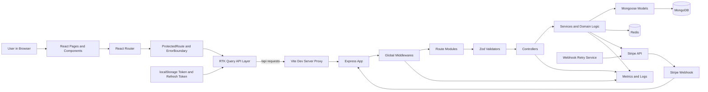
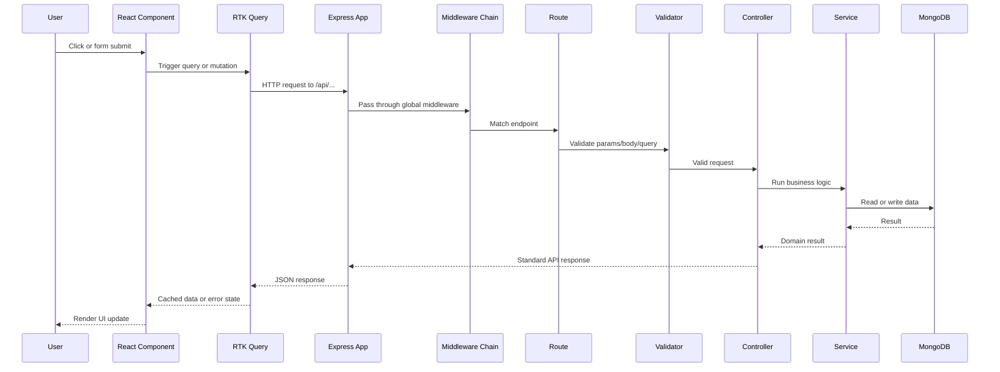
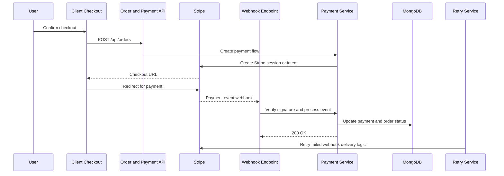
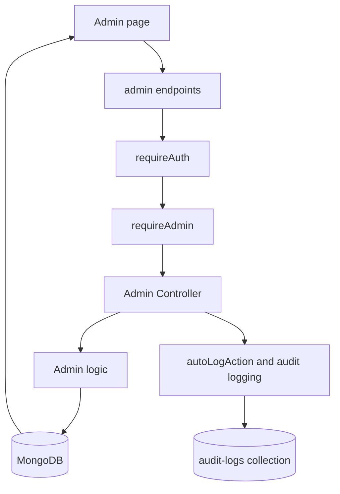
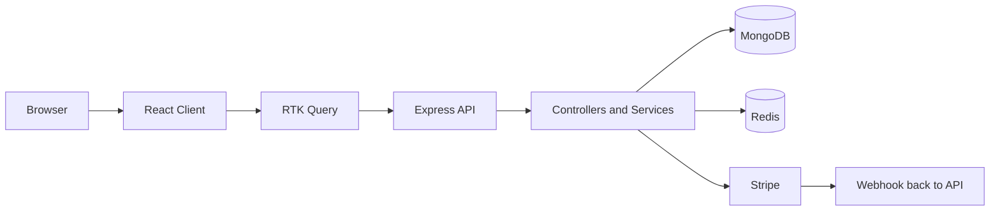

# Project Information Flow Diagram

מסמך זה מרכז את זרימת המידע של כל הפרויקט מקצה לקצה: לקוח, API, שכבות שרת, מסדי נתונים, תשלומים, לוגים ותהליכי רקע.

מטרות המסמך:
- להציג תמונה אחת מקצועית וברורה של המערכת כולה
- לעזור בהסבר בעל פה בהגשה או בהגנת פרויקט
- להראות איך מידע זורם בין כל החלקים, ולא רק בתוך קובץ בודד

---

## מבט על: זרימת המידע של כל המערכת



### קריאה נכונה של התרשים

1. המשתמש פועל דרך דפי React ורכיבים.
2. שכבת RTK Query מרכזת את כל הקריאות לשרת.
3. השרת עובר דרך middlewares גלובליים לפני שהבקשה מגיעה ל-route הרלוונטי.
4. אחרי route, הבקשה עוברת אימות, controller, service, ואז storage חיצוני כמו MongoDB, Redis או Stripe.
5. במקביל, המערכת אוספת logging, metrics ו-audit context.

---

## שכבות הפרויקט ומה האחריות של כל שכבה

| שכבה | אחריות מרכזית | דוגמאות מהפרויקט |
|------|----------------|------------------|
| Client UI | הצגת מידע ואינטראקציה עם המשתמש | pages, components, forms, modals |
| Client State/API | שליחת בקשות, cache, retry, token refresh | `client/src/api.ts` |
| Routing | שליטה במסכים ציבוריים ומוגנים | `client/src/App.tsx` |
| Express App | בניית השרת ורישום middleware/routes | `server/src/app.ts` |
| Middleware | אבטחה, CORS, parsing, request ID, audit, logging, metrics | `server/src/middlewares/*` |
| Routes | חיבור endpoint ל-controller | `server/src/routes/*` |
| Validators | בדיקות קלט וכללי פורמט | `server/src/validators/*` |
| Controllers | המרת HTTP ל-business actions | `server/src/controllers/*` |
| Services | הלוגיקה העסקית המרכזית | `server/src/services/*` |
| Models | גישה למסד ו-schema rules | `server/src/models/*` |
| Infrastructure | MongoDB, Redis, Stripe, retry jobs | `server/src/config/*`, `server/src/services/*` |

---

## זרימת בקשה רגילה: מהדפדפן עד למסד הנתונים וחזרה



### העיקרון החשוב

הלקוח לא מדבר ישירות עם MongoDB או Stripe. כל המידע עובר דרך API מבוקר, עם middleware, validation ותגובה בפורמט אחיד.

---

## זרימת Authentication מלאה

```mermaid
flowchart TD
    LoginUI[Login or Google Login UI] --> AuthApi[authApi mutation]
    AuthApi --> AuthRoute[/api/auth routes]
    AuthRoute --> RateLimit[Auth rate limiter]
    RateLimit --> AuthController[Auth Controller]
    AuthController --> AuthValidator[Zod validation]
    AuthValidator --> AuthService[Auth Service]
    AuthService --> UserModel[User Model]
    UserModel --> Mongo[(MongoDB users)]
    AuthService --> Jwt[JWT access and refresh tokens]
    Jwt --> Response[API response with user and tokens]
    Response --> Store[localStorage]
    Store --> Protected[ProtectedRoute verifies access]
    Protected --> ProfileUI[Protected pages: profile, orders, checkout, admin]
```

### נקודות מקצועיות שכדאי להסביר

- `client/src/api.ts` מוסיף `Authorization` header לכל בקשה רלוונטית.
- במקרה של `401`, הלקוח מנסה `refresh` פעם אחת לפני ניתוק המשתמש.
- ב-Google OAuth השרת מאמת את ה-`idToken` מול Google ומחזיר `400` על token לא תקין.

---

## זרימת קנייה מקצה לקצה

```mermaid
flowchart LR
    Browse[Browse products] --> ProductPage[Product page]
    ProductPage --> AddToCart[Add to cart mutation]
    AddToCart --> CartRoute[/api/cart]
    CartRoute --> CartController[Cart Controller]
    CartController --> CartService[Cart Service]
    CartService --> ProductCheck[Check product and stock]
    ProductCheck --> CartModel[Cart Model]
    CartModel --> Mongo[(MongoDB carts and products)]
    Mongo --> CartUI[Updated cart UI]
    CartUI --> Checkout[Checkout page]
    Checkout --> OrderRoute[/api/orders]
    OrderRoute --> OrderController[Order Controller]
    OrderController --> OrderService[Order creation logic]
    OrderService --> OrderModel[Order and payment models]
    OrderModel --> Mongo
    OrderService --> StripeSession[Create Stripe checkout session]
    StripeSession --> Redirect[Redirect user to Stripe]
```

### מה קורה בנתיב הזה בפועל

1. המשתמש בוחר מוצר ומוסיף אותו לעגלה.
2. השרת בודק זהות משתמש, תקינות קלט, קיום מוצר וזמינות.
3. העגלה נשמרת ב-MongoDB ומוחזרת ללקוח.
4. בזמן checkout השרת יוצר order ו-payment context.
5. אם צריך תשלום חיצוני, המשתמש נשלח ל-Stripe.

---

## זרימת תשלומים ו-Webhook



### מה חשוב כאן

- למסלול webhook יש `express.raw()` לפני `express.json()` כדי לאפשר אימות חתימה.
- תשלום לא מסתיים רק בצד לקוח; הסטטוס הסופי מתעדכן מה-webhook של Stripe.
- יש מנגנון retry לטיפול בכשלי webhook במקום להסתמך על הצלחה חד-פעמית.

---

## זרימת Admin וניהול מערכת



### למה זה חשוב להגנה

התרשים הזה מראה שה-admin הוא לא רק UI נפרד, אלא זרימה עם שכבות הרשאה, כתיבה למסד ותיעוד פעולות רגישות.

---

## תשתיות רוחב: מה רץ כמעט בכל בקשה

```mermaid
flowchart LR
    Request[Incoming request]
    Helmet[helmet]
    Cors[CORS]
    Parse[JSON and URL encoded parsing]
    RequestId[requestIdMiddleware]
    Audit[auditLoggingMiddleware]
    Logger[requestLoggerMiddleware]
    Metrics[metricsMiddleware]
    Route[Matched route]
    Error[Global error handler]
    Response[HTTP response]

    Request --> Helmet --> Cors --> Parse --> RequestId --> Audit --> Logger --> Metrics --> Route --> Response
    Route -. error .-> Error --> Response
```



### משמעות תפעולית

- כל בקשה מקבלת מזהה ייחודי למעקב.
- השרת מעשיר את הבקשה בפרטי audit לפני ה-controller.
- metrics ו-logging נותנים תצפית על ביצועים ותקלות.
- כל שגיאה לא מטופלת מתנקזת ל-`errorHandler` אחיד.

---

## מפת האחסון של המערכת

| רכיב מידע | נשמר איפה | למה |
|-----------|-----------|-----|
| משתמשים | MongoDB `users` | זהויות, הרשאות, tokenVersion, פרופיל |
| מוצרים | MongoDB `products` | קטלוג, מחיר, מלאי, סטטוס |
| עגלות | MongoDB `carts` | פריטי קנייה לפי משתמש |
| הזמנות | MongoDB `orders` | snapshot של רכישה, סטטוסים, items |
| תשלומים | MongoDB `payments` + webhook collections | מעקב על תהליך תשלום ואירועי Stripe |
| audit logs | MongoDB `audit-logs` | תיעוד פעולות רגישות |
| cache/infrastructure | Redis | cache ותשתית מהירה לפי שימושי השרת |
| token client-side | localStorage | שמירת access/refresh token בצד הלקוח |

---

## איך להציג את זה מקצועית בהגשה

אפשר להסביר את הפרויקט בשלושה משפטים:

1. הלקוח בנוי ב-React ומדבר עם השרת דרך RTK Query בלבד.
2. השרת בנוי בשכבות ברורות: middleware, routes, validators, controllers, services, models.
3. פעולות פשוטות נשמרות ב-MongoDB, ופעולות תשלום עוברות גם דרך Stripe עם webhook מאומת ו-retry service.

---

## תרשים קצר להצגה בעל פה



זה התרשים הקצר ביותר ששומר על התמונה המקצועית של המערכת.