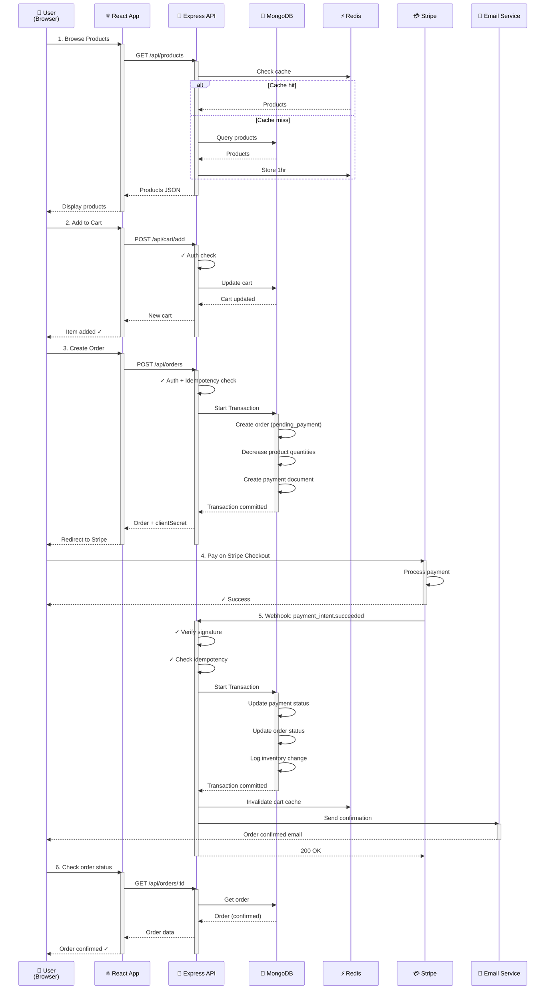
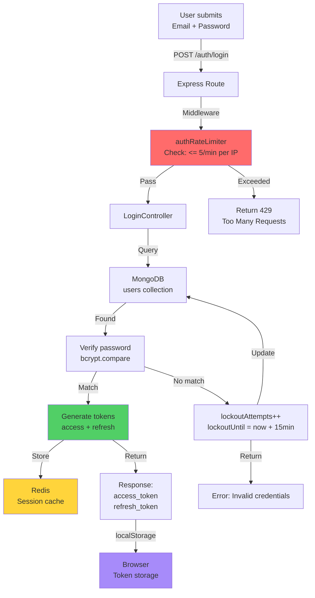
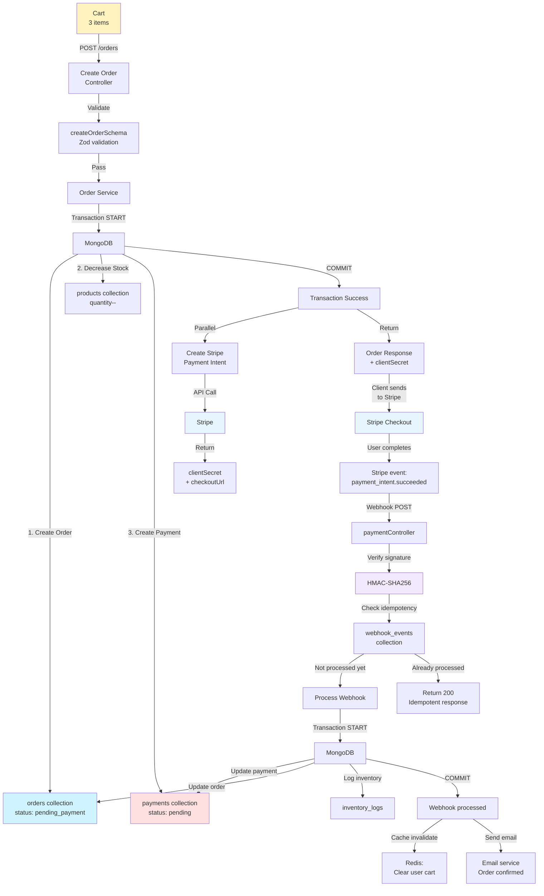
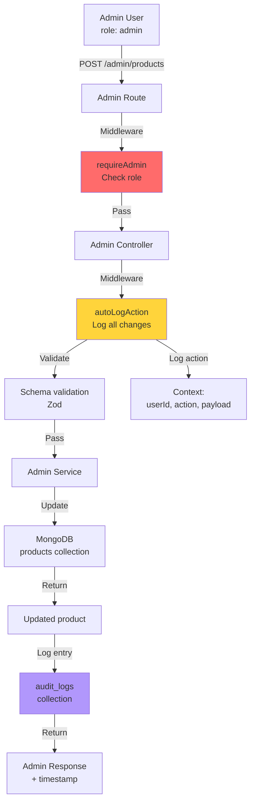
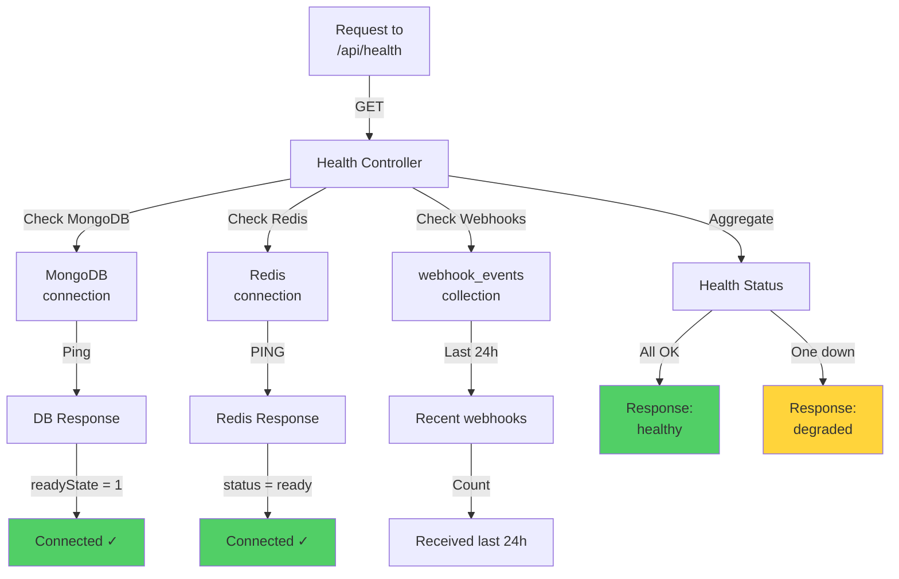
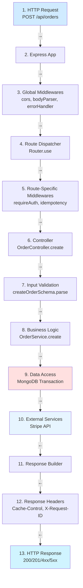
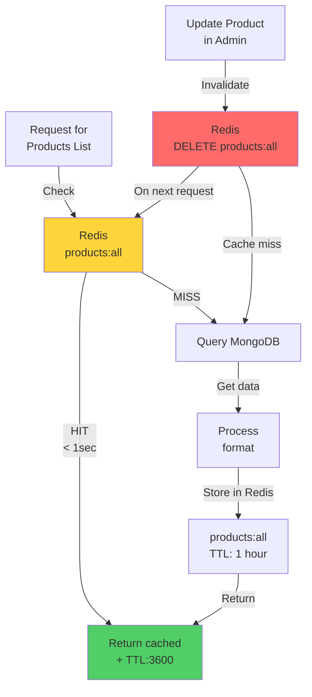
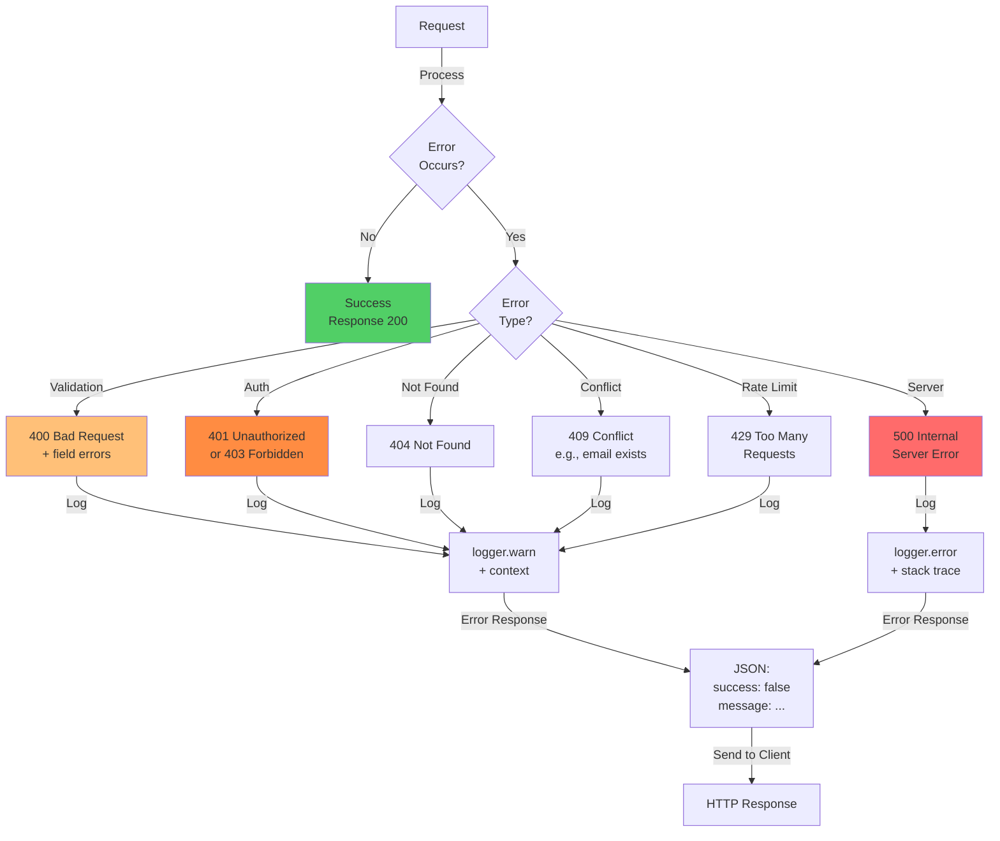
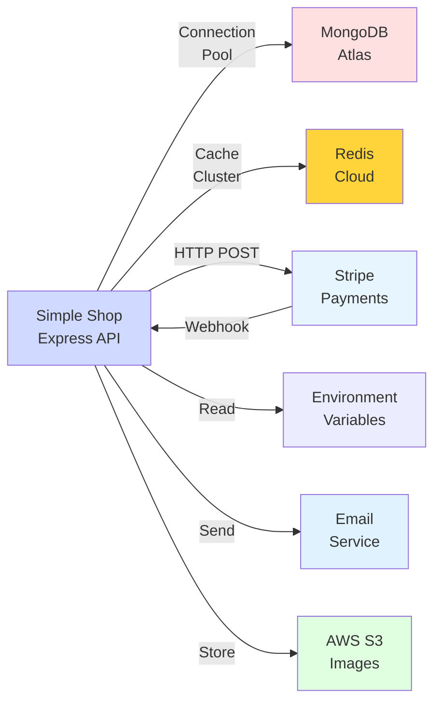
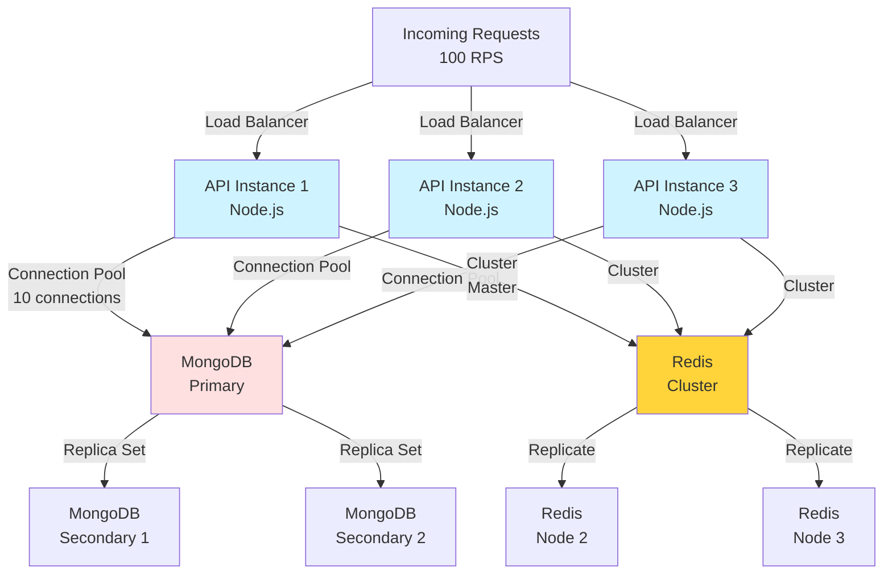

# 🔄 Data Flow Diagram - זרימת מידע מלאה

## דיאגרמה כללית - From User to Payment

---

## זרימה לפי מודול

### 🔐 Authentication Flow

### 🛒 Cart → Order → Payment Flow

### 👥 Admin Management Flow

### 📊 Health & Monitoring

---

## שכבות Request - מלמעלה למטה

---

## Cache Strategy

---

## Error Handling Flow

---

## Integration Points - שירותים חיצוניים

---

## Load & Scalability

