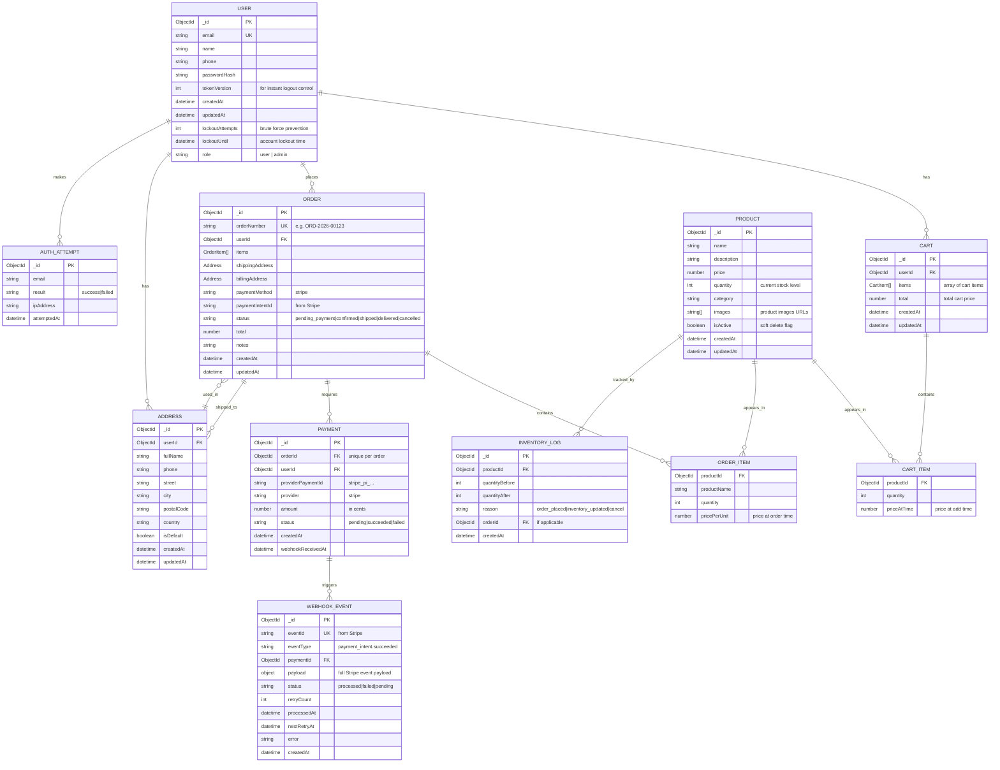

# 📊 Database Diagram - Mermaid Professional

## דיאגרמת ER (Entity-Relationship) מלאה



---

## סכמה טקסטית - מבנה קבצים

```
Simple Shop MongoDB
│
├─ users (אוסף משתמשים)
│  ├─ _id: ObjectId
│  ├─ email: string (unique)
│  ├─ passwordHash: string
│  ├─ name: string
│  ├─ tokenVersion: number
│  ├─ role: "user" | "admin"
│  ├─ lockoutUntil: datetime (nullable)
│  ├─ createdAt: datetime
│  └─ updatedAt: datetime
│
├─ products (קטלוג מוצרים)
│  ├─ _id: ObjectId
│  ├─ name: string
│  ├─ description: string
│  ├─ price: number (בדולרים)
│  ├─ quantity: number (מלאי)
│  ├─ category: string
│  ├─ images: string[]
│  ├─ isActive: boolean
│  ├─ createdAt: datetime
│  └─ updatedAt: datetime
│
├─ carts (עגלות קניות)
│  ├─ _id: ObjectId
│  ├─ userId: ObjectId (reference)
│  ├─ items: [
│  │   {
│  │     productId: ObjectId,
│  │     quantity: number,
│  │     priceAtTime: number
│  │   }
│  │ ]
│  ├─ total: number
│  ├─ createdAt: datetime
│  └─ updatedAt: datetime
│
├─ orders (הזמנות)
│  ├─ _id: ObjectId
│  ├─ orderNumber: string (unique, e.g., "ORD-2026-00123")
│  ├─ userId: ObjectId (reference)
│  ├─ items: [ { productId, quantity, pricePerUnit, productName } ]
│  ├─ shippingAddress: { fullName, phone, street, city, postalCode, country }
│  ├─ billingAddress: { ... }
│  ├─ paymentMethod: "stripe"
│  ├─ paymentIntentId: string (מ-Stripe)
│  ├─ status: "pending_payment" | "confirmed" | "shipped" | "delivered" | "cancelled"
│  ├─ total: number
│  ├─ notes: string
│  ├─ createdAt: datetime
│  └─ updatedAt: datetime
│
├─ payments (תשלומים)
│  ├─ _id: ObjectId
│  ├─ orderId: ObjectId (unique reference)
│  ├─ userId: ObjectId (reference)
│  ├─ providerPaymentId: string (stripe_pi_...)
│  ├─ provider: "stripe"
│  ├─ amount: number (בסנטים)
│  ├─ status: "pending" | "succeeded" | "failed"
│  ├─ createdAt: datetime
│  └─ webhookReceivedAt: datetime
│
├─ addresses (כתובות משתמשים)
│  ├─ _id: ObjectId
│  ├─ userId: ObjectId (reference)
│  ├─ fullName: string
│  ├─ phone: string
│  ├─ street: string
│  ├─ city: string
│  ├─ postalCode: string
│  ├─ country: string
│  ├─ isDefault: boolean
│  ├─ createdAt: datetime
│  └─ updatedAt: datetime
│
├─ webhook_events (אירועי Webhook)
│  ├─ _id: ObjectId
│  ├─ eventId: string (unique, from Stripe)
│  ├─ eventType: string
│  ├─ paymentId: ObjectId (reference)
│  ├─ payload: object (הודעת Stripe המלאה)
│  ├─ status: "processed" | "failed" | "pending"
│  ├─ retryCount: number
│  ├─ error: string (nullable)
│  ├─ processedAt: datetime
│  ├─ nextRetryAt: datetime
│  └─ createdAt: datetime
│
├─ auth_attempts (ניסיונות התחברות)
│  ├─ _id: ObjectId
│  ├─ email: string
│  ├─ result: "success" | "failed"
│  ├─ ipAddress: string
│  └─ attemptedAt: datetime
│
└─ inventory_logs (רישום שינויי מלאי)
   ├─ _id: ObjectId
   ├─ productId: ObjectId (reference)
   ├─ quantityBefore: number
   ├─ quantityAfter: number
   ├─ reason: "order_placed" | "inventory_updated" | "cancel"
   ├─ orderId: ObjectId (nullable, reference)
   └─ createdAt: datetime
```

---

## אינדקסים המומלצים

```typescript
// users collection
db.users.createIndex({ email: 1 }, { unique: true });
db.users.createIndex({ createdAt: -1 });
db.users.createIndex({ role: 1 });

// products collection
db.products.createIndex({ category: 1 });
db.products.createIndex({ isActive: 1 });
db.products.createIndex({ createdAt: -1 });

// orders collection
db.orders.createIndex({ userId: 1, createdAt: -1 });
db.orders.createIndex({ orderNumber: 1 }, { unique: true });
db.orders.createIndex({ status: 1 });
db.orders.createIndex({ createdAt: -1 });

// payments collection
db.payments.createIndex({ orderId: 1 }, { unique: true });
db.payments.createIndex({ userId: 1 });
db.payments.createIndex({ status: 1 });

// webhook_events collection
db.webhook_events.createIndex({ eventId: 1 }, { unique: true });
db.webhook_events.createIndex({ status: 1 });
db.webhook_events.createIndex({ processedAt: -1 });
db.webhook_events.createIndex({ createdAt: 1 }, { 
  expireAfterSeconds: 2592000 // 30 ימים - מחיקה אוטומטית
});

// addresses collection
db.addresses.createIndex({ userId: 1, isDefault: 1 });
db.addresses.createIndex({ createdAt: -1 });
```

---

## טיפול בזיכרון (Storage)

| Collection | Typical Docs | Avg Size | Total |
|---|---|---|---|
| users | 10,000 | 2 KB | 20 MB |
| products | 5,000 | 5 KB | 25 MB |
| carts | 2,000 | 10 KB | 20 MB |
| orders | 50,000 | 8 KB | 400 MB |
| payments | 50,000 | 3 KB | 150 MB |
| addresses | 20,000 | 2 KB | 40 MB |
| webhook_events | 100,000 | 4 KB | 400 MB |
| auth_attempts | 500,000 | 0.5 KB | 250 MB |

**סה"כ משוער:** ~1.3 GB בעומס בינוני

---

## Transactions - אטומיות

**Order Creation transaction:**
```
1. Create order document (status: pending_payment)
2. Decrease product quantities
3. Create payment document
4. הכל או כלום - אם כשלה שלב, כלום לא השתנה
```

**Payment Confirmation transaction:**
```
1. Update payment status to succeeded
2. Update order status to confirmed
3. Log inventory change
4. הכל או כלום
```
